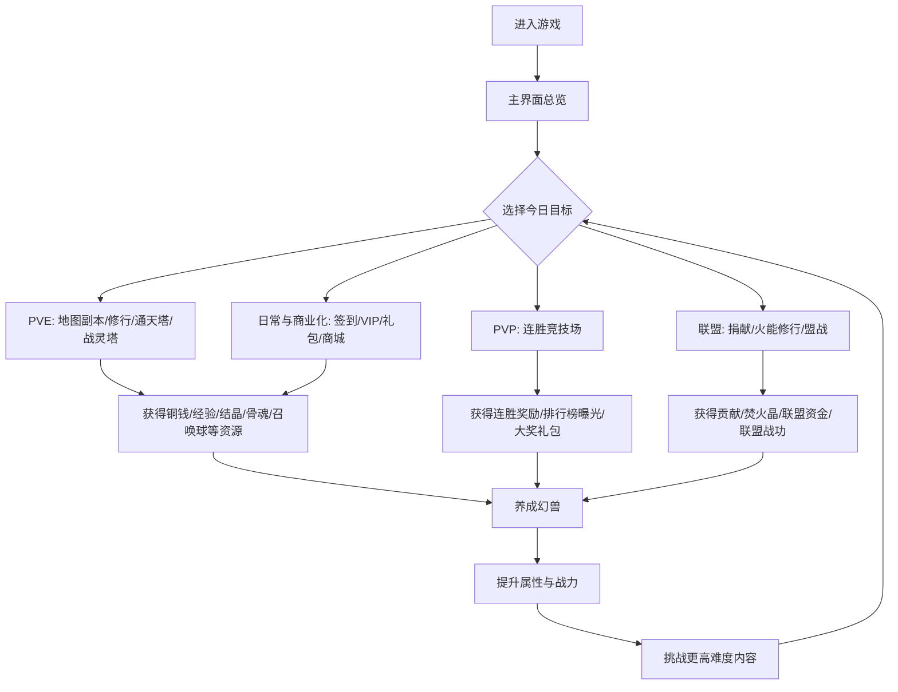
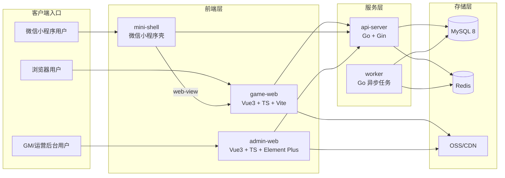
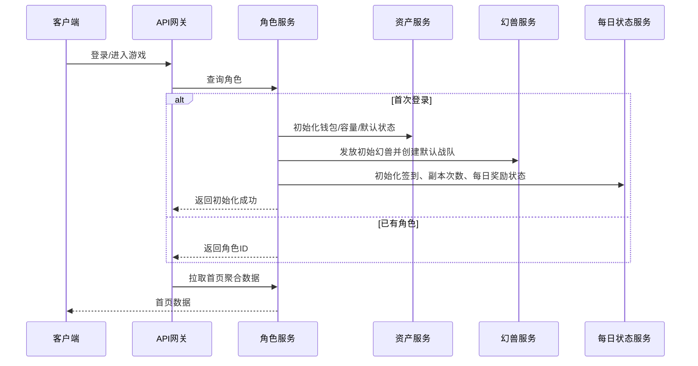
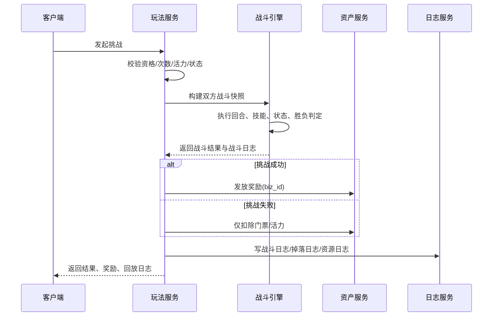
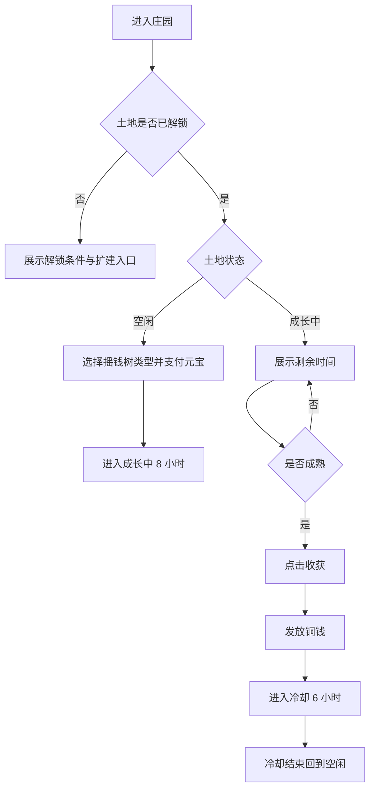
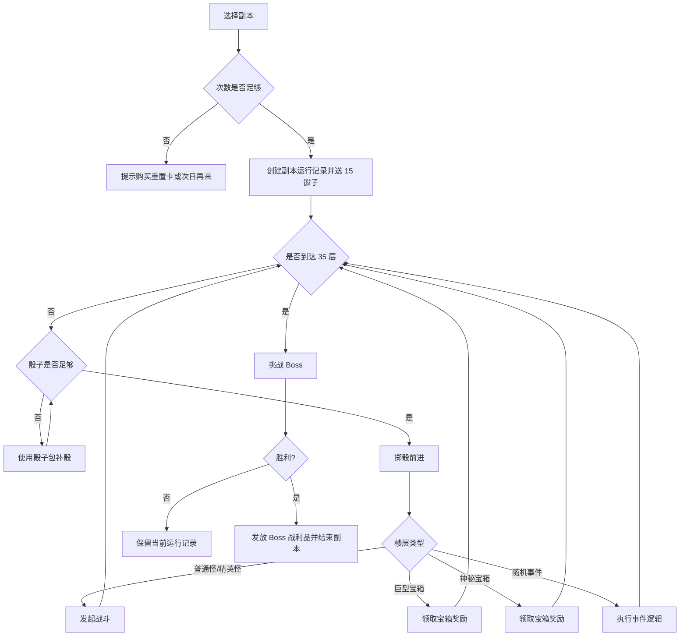
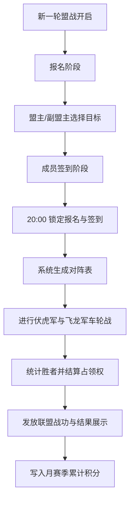
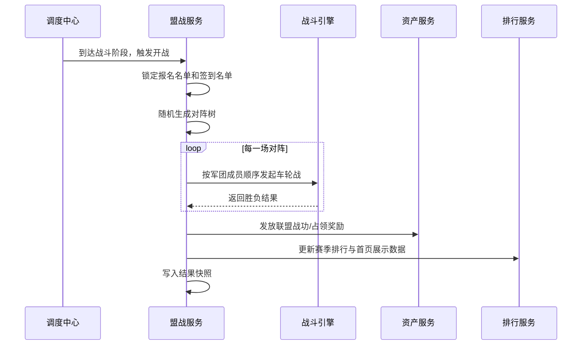

# 召唤之王首发版详细设计文档

> **文档用途：** 作为《召唤之王》首发版的统一开发基线，覆盖前端 H5、后端服务、配置后台、GM 后台、数值配置、定时任务与测试口径。  
> **文档状态：** 评审稿 V1  
> **编写日期：** 2026-03-21  
> **基于文档：** 当前目录全部需求文档与补充说明文档  
> **适用角色：** 产品、前端、后端、数值、测试、运营、GM

---

## 1. 文档来源与使用原则

### 1.1 已纳入的原始需求文档

#### 总体需求
- `召唤之王详细需求文档.pdf`

#### 幻兽 / 战斗 / 数值
- `召唤之王/幻兽图鉴说明、.doc`
- `召唤之王/各地图副本中幻兽的属性情况.doc`
- `召唤之王/技能说明、.docx`
- `召唤之王/战力数值说明.docx`
- `召唤之王/通天塔每层幻兽说明.doc`
- `召唤之王/战灵塔每层幻兽说明、.dot`

#### 养成系统
- `召唤之王/战骨说明.doc`
- `召唤之王/战灵说明.docx`
- `召唤之王/魔魂说明、.docx`
- `召唤之王/炼妖壶说明.docx`
- `召唤之王/化仙池说明.docx`
- `召唤之王/庄园说明、.docx`

#### PVE / PVP
- `召唤之王/地图副本说明.doc`
- `召唤之王/幻兽战利品说明.docx`
- `召唤之王/各地图副本修行获得的玩家声望和幻兽经验、强化石说明、.doc`
- `召唤之王/连胜竞技场说明.docx`

#### 联盟 / 盟战
- `召唤之王/联盟说明.docx`
- `召唤之王/联盟内各建筑升级说明.doc`
- `召唤之王/联盟盟战说明.docx`

#### 商业化 / 日常
- `召唤之王/VIP解释.docx`
- `召唤之王/兑换区域的礼包区域对应礼包名字及内容.docx`
- `召唤之王/炼魂丹获取途径及每日任务相应礼包内容.docx`
- `召唤之王/签到说明、.docx`

### 1.2 使用原则
- 以 `召唤之王详细需求文档.pdf` 作为首要范围基线。
- 各子系统专门文档作为数值和规则细化来源。
- 对冲突项，本设计文档给出 **建议冻结口径**，待你评审后作为最终开发口径。
- 所有高频规则必须配置化，不允许在业务代码中写死数值。

---

## 2. 产品理解与版本目标

《召唤之王》是一款以 **幻兽养成 + 数值战斗 + 地图副本 + 塔类挑战 + 联盟社交 + 商业化成长** 为核心的 H5 文字游戏。

首发版不是“最小可玩 Demo”，而是接近正式首发版的完整版本，包含：
- 单人养成闭环
- 地图副本 / 修行 / 通天塔 / 战灵塔等 PVE
- 连胜竞技场、排行榜
- 联盟、火能修行、盟战
- VIP、商城、礼包、兑换、签到
- GM 后台、配置后台、日志与定时结算

### 2.1 核心主循环



### 2.2 设计原则
- 首页是“功能中枢”，不是装饰页。
- 幻兽详情页是“养成中枢”，不是图鉴资料页。
- 地图系统必须体现成长路径：大陆 -> 城市 -> 副本。
- 联盟页是“次级主城”，要聚合成员、建筑、火能修行、盟战、公告、动态。
- VIP 的核心价值是效率、次数、容量、便利性，不是纯送资源。
- 一切奖励发放、战斗结算、计时结算必须服务端主导。

---

## 3. 版本范围与建议冻结口径

### 3.1 本次开发范围

#### 前台玩家系统
- 账号与角色初始化
- 首页与导航
- 资源展示
- 背包 / 幻兽栏 / 灵件室 / 储魂器 / 联盟寄存仓库 / 联盟幻兽室
- 幻兽图鉴、获取、上阵、升级、养成
- 技能系统
- 战骨 / 战灵 / 魔魂 / 炼妖壶 / 化仙池 / 庄园
- 地图副本、修行、通天塔、战灵塔
- 连胜竞技场、排行榜
- 联盟、火能修行、盟战
- VIP、商城、礼包、兑换、签到、每日可领聚合

#### 后台与中台
- 配置后台
- GM 玩家查询与补偿后台
- 报表查询
- 定时任务监控
- 审计日志与结构化日志

### 3.2 明确不开发
- 联盟天赋池
- 盟主天赋研发
- 盟众天赋学习
- 圣兽山
- 精英战队

### 3.3 冲突项与建议冻结口径

| 编号 | 问题 | 原始文档冲突/缺失 | 建议冻结口径 |
| --- | --- | --- | --- |
| F1 | 庄园种植时间 | `庄园说明` 写 6 小时；主 PDF 已确认 8 小时成熟 + 6 小时冷却 | 以主 PDF 为准：**8 小时成熟，收获后 6 小时冷却** |
| F2 | 战灵免费洗炼次数 | `VIP解释` 与 `战灵说明` 冲突 | 以 `战灵说明` 为准：**VIP0-5=1 次，VIP6=3，VIP7=5，VIP8=7，VIP9=9，VIP10=12** |
| F3 | 副本 VIP8 次数 | `地图副本说明` 缺 VIP8 | 建议冻结：**VIP2-4=2 次/天，VIP5-8=3 次/天，VIP9-10=4 次/天** |
| F4 | 修行 24 小时开放档位 | `VIP解释` 与修行收益文档冲突 | 以 `VIP解释` 为准：**12 小时 VIP2 开，24 小时 VIP5 开** |
| F5 | 地图副本怪物技能是否触发 | 主 PDF 标为待确认；副本文档写“技能只是摆设，不会触发” | 冻结为：**地图副本普通怪/精英/Boss 技能仅展示不触发；PVP/盟战/塔类启用完整技能结算** |
| F6 | 初始角色资源、初始幻兽 | 原文档未给明确数值 | 用配置表 `player_init_def` 冻结；联调默认值见 4.2 |
| F7 | 幻兽最大上阵数量 | 原文档缺失 | 设计为 **可配置**，默认 `battle_team_size = 5` |
| F8 | 通天塔规则缺失 | 缺开启条件、奖励、次数、重置、排行 | 采用本设计 8.14 节默认方案 |
| F9 | 战灵塔规则缺失 | 缺开启条件、奖励、次数、重置、排行 | 采用本设计 8.15 节默认方案 |

> 说明：以上冻结口径的目标是让开发可直接启动。你评审时如需改动，只要改配置表或状态机即可，不影响整体架构。

---

## 4. 总体技术方案

### 4.1 架构选型

**推荐：模块化单体后端 + 配置驱动 + 定时任务中心 + GM/配置后台分域。**

原因：
- 本项目系统多但耦合强，核心耦合点集中在玩家资产、幻兽养成、战斗结算、奖励发放。
- 首发版最重要的是 **统一口径、快速联调、低心智负担、可审计**。
- 分布式微服务会显著增加事务一致性、联调和运维成本，不适合当前阶段。

### 4.2 建议的技术边界
- **前端：** H5 SPA，HTTP API + WebSocket（聊天/动态推送/红点刷新可选）
- **后端：** 单仓模块化业务服务
- **数据库：** MySQL（主业务）
- **缓存：** Redis（会话、排行榜、临时房间、限流、定时状态）
- **异步：** 任务队列 + Worker 执行器，承担结算、调度、日志聚合、榜单快照
- **后台：** 配置后台、GM 后台、报表后台
- **日志：** 结构化日志 + 资源流水 + 高价值审计日志

### 4.3 已冻结的技术栈搭配

#### 4.3.1 玩家 H5 前端
- 语言：`TypeScript`
- 框架：`Vue 3`
- 构建：`Vite`
- 状态管理：`Pinia`
- 路由：`Vue Router`
- UI：`Vant`
- 请求层：`Axios`
- 样式方案：`UnoCSS` 或 `Tailwind CSS`

#### 4.3.2 GM / 配置后台
- 语言：`TypeScript`
- 框架：`Vue 3`
- 构建：`Vite`
- UI：`Element Plus`
- 图表：`ECharts`

#### 4.3.3 后端与中间件
- 语言：`Go 1.22+`
- Web 框架：`Gin`
- 数据库：`MySQL 8`
- 缓存：`Redis`
- 数据访问：
  - 第一阶段：`GORM`
  - 热点复杂查询可逐步迁移到 `sqlc`
- 异步任务：
  - 第一阶段推荐：`Asynq` 或自建 `job worker`
  - 负责每日重置、盟战阶段切换、庄园成熟、修行到期、榜单快照、赛季结算
- 监控日志：
  - `Prometheus + Grafana`
  - `Loki` 或 ELK

#### 4.3.4 部署基础设施
- 反向代理：`Nginx`
- 容器化：`Docker`
- 静态资源：`OSS / CDN`

> 冻结结论：首发版采用 `Vue 3 + TypeScript + Go + MySQL + Redis + Nginx + Docker`。

### 4.4 多端交付策略

#### 4.4.1 冻结方案
首发版采用：
- **H5 官网版**：浏览器直接打开 `game-web`
- **微信小程序版**：`mini-shell` 小程序壳通过 `web-view` 承载同一套 `game-web`
- **GM/配置后台**：独立后台前端
- **后端**：三端共用同一套 Go API、同一套数据库、同一套配置和 GM 体系

#### 4.4.2 为什么不首发重写原生小程序
- 本项目系统页多、养成页多、配置逻辑复杂，首发阶段重写原生小程序前端成本过高
- 微信小程序主包/分包限制较紧，不适合在首发阶段把完整游戏页面全部编译进小程序
- 本项目为文字/菜单/数值型玩法，`web-view` 方案在体验上可接受，但工程收益更高

#### 4.4.3 小程序壳能力边界
`mini-shell` 只负责：
- 微信登录票据获取
- 原生支付承接
- 分享能力承接
- 客服、退出、环境识别
- `web-view` 容器页

`game-web` 负责：
- 所有玩家主游戏页面
- 所有战斗前端表现与交互逻辑
- 所有养成、PVE、PVP、联盟、商业化页面

#### 4.4.4 业务前提与限制
- 小程序需配置业务域名，`web-view` 承载的 H5 域名必须提前备案与配置
- 小程序若采用 `web-view` 方案，需使用支持该能力的主体类型
- 小程序内不能假定拥有与 H5 官网完全一致的浏览器能力，必须通过 bridge 调用渠道能力

### 4.5 系统分层



### 4.6 后端实现形态与模块拆分

#### 4.6.1 运行进程
- `cmd/api`：对外提供 HTTP / WebSocket API
- `cmd/worker`：执行异步任务与定时任务

#### 4.6.2 后端模块
- `account`：渠道登录、票据换会话、统一登录态
- `player`：角色、首页聚合、基础信息
- `asset`：货币、道具、统一资产流水
- `pet`：幻兽、图鉴、上阵、详情、养成入口
- `battle`：统一战斗引擎
- `dungeon`：地图副本、修行
- `tower`：通天塔、战灵塔
- `arena`：连胜竞技场、排行榜
- `alliance`：联盟、火能修行、盟战
- `commerce`：VIP、商城、礼包、兑换、签到
- `gm`：GM 操作、补偿、审计
- `config`：配置读取、发布、校验

#### 4.6.3 强约束
- 所有扣费、领奖、发奖必须只经过 `asset` 模块
- 所有战斗必须只经过 `battle` 模块
- 所有玩法只能读取统一的玩家阵容和统一的服务端时间

### 4.7 H5 与小程序壳 bridge 设计

#### 4.7.1 目标
将渠道相关能力从 `game-web` 中剥离，保证：
- 官网 H5 与小程序版共用同一套主游戏前端
- 渠道差异收敛到 bridge 层
- 后端统一识别账号、订单、角色和支付结果

#### 4.7.2 统一桥接接口

```ts
interface GameBridge {
  getEnv(): 'web' | 'wxmini'
  login(): Promise<LoginResult>
  pay(payload: PayRequest): Promise<PayResult>
  share(payload: ShareRequest): Promise<void>
  openService(): void
  exit(): void
}
```

#### 4.7.3 登录流程
- 官网 H5：走普通网页登录态
- 小程序版：
  1. `mini-shell` 调用 `wx.login`
  2. 小程序壳请求 Go 后端换取 `unified_token`
  3. 打开 `game-web`：`https://game.xxx.com?channel=wxmini&token=xxx`
  4. H5 使用该 token 兑换正式游戏会话

#### 4.7.4 支付流程
- H5 内点击充值，仅创建订单，不直接做最终支付
- 若当前环境为 `wxmini`，则 H5 通过 bridge 请求小程序壳承接支付
- 小程序壳向后端获取微信支付参数
- 小程序壳发起原生支付
- 支付成功后回传 H5，H5 主动刷新资产和礼包状态
- 最终到账以服务端支付回调为准

#### 4.7.5 分享流程
- H5 只负责产出分享标题、描述、落地参数
- 官网版可走复制链接/海报分享
- 小程序版由 `mini-shell` 调起微信分享能力

### 4.8 部署与发布方案

#### 4.8.1 域名规划
- `game.xxx.com`：玩家 H5 官网版
- `admin.xxx.com`：GM / 配置后台
- `api.xxx.com`：Go API 服务
- `static.xxx.com`：静态资源 / CDN / 活动素材

#### 4.8.2 部署组成
- `api-server`：Gin 主服务
- `worker`：任务执行器
- `MySQL 8`：主业务库
- `Redis`：缓存、排行榜、分布式锁、临时状态
- `Nginx`：代理与静态资源入口
- `OSS / CDN`：图片、构建产物、公告图、活动图

#### 4.8.3 小程序相关部署要求
- 小程序 `web-view` 业务域名指向 `game.xxx.com`
- 小程序 request 域名需要包含 `api.xxx.com`
- 支付回调只允许后端接收
- 登录态中必须保存渠道字段：`web` / `wxmini`

#### 4.8.4 发布顺序
1. 发布配置或保持向后兼容
2. 发布 Go 服务
3. 发布 H5 前端与后台前端
4. 观察支付、发奖、榜单、定时任务日志
5. 确认无误后再进行活动配置切换

### 4.9 推荐目录结构

```text
zhzw/
├─ apps/
│  ├─ game-web/
│  ├─ admin-web/
│  ├─ mini-shell/
│  └─ backend/
├─ packages/
│  ├─ api-contracts/
│  ├─ config-schema/
│  └─ shared-constants/
├─ deploy/
├─ docs/
└─ Makefile
```

### 4.10 联调默认初始化值

> 以下仅为 **联调默认值**，正式上线前仍由配置后台可调。

- 玩家等级：1
- 玩家经验：0
- VIP：0
- 铜钱：5000
- 元宝：0
- 宝石：0
- 活力：100/100
- 普通背包容量：30
- 幻兽栏容量：5
- 灵件室容量：100
- 储魂器容量：50
- 初始幻兽：1 只，来源配置 `starter_pet_template_id`
- 默认战斗队伍：1 号位自动上阵初始幻兽
- 默认每日状态：签到未领、副本次数已初始化、连胜奖励未领、VIP 宝箱未领

---

## 5. 领域模块划分

### 5.1 模块总表

| 模块 | 职责 |
| --- | --- |
| 账号与角色模块 | 账号接入、角色初始化、首页总览、公告入口 |
| 资源与资产模块 | 货币、道具、资源流水、统一扣发校验 |
| 背包与存储模块 | 普通背包、幻兽栏、灵件室、储魂器、联盟仓库 |
| 幻兽模块 | 图鉴、实例、上阵、升级、资质、境界、来源 |
| 战斗引擎 | 回合、速度判定、普通攻击、技能触发、状态结算、胜负判定 |
| 养成模块 | 战骨、战灵、魔魂、炼妖壶、化仙池、庄园 |
| PVE 模块 | 世界地图、城市、副本、修行、通天塔、战灵塔 |
| PVP 模块 | 连胜竞技场、连胜奖励、排行榜 |
| 联盟模块 | 创建、申请、审批、成员、公告、聊天、捐献、建筑、火能修行、盟战 |
| 商业化模块 | VIP、商城、礼包、兑换、签到、每日收益聚合 |
| GM/配置/报表模块 | 配置发布、玩家查询、GM 操作、统计报表、定时任务状态 |
| 调度与审计模块 | 每日重置、赛季结算、阶段切换、幂等补偿、审计日志 |

### 5.2 统一业务原则
- 所有资产变化必须经过 `AssetTxnService`。
- 所有奖励发放必须带唯一业务键 `biz_id`，防止重复领奖。
- 所有玩法读取同一套玩家战斗队伍；修行队伍与战斗队伍一致。
- 所有玩法的数值都来自配置表，不从页面文案反推。
- 所有时间都以服务端时区为准（Asia/Shanghai）。

---

## 6. 核心数据模型设计

### 6.1 玩家与资产核心实体

| 实体 | 关键字段 |
| --- | --- |
| `player_account` | `player_id`、账号标识、创建时间、封禁状态 |
| `player_profile` | 等级、经验、VIP 等级、战力、主城展示信息 |
| `player_wallet` | 铜钱、元宝、宝石、活力、声望、贡献、联盟战功、焚火晶、灵力等 |
| `player_daily_state` | 签到状态、每日宝箱状态、连胜奖励状态、招财神符次数、竞技刷新时间等 |
| `resource_change_log` | 玩家、资源类型、变化量、前后值、来源模块、biz_id、操作者 |
| `player_notice_state` | 红点聚合状态、已读公告、功能解锁提示 |

### 6.2 存储实体

| 实体 | 说明 |
| --- | --- |
| `inventory_item` | 普通背包道具实例 |
| `pet_instance` | 玩家拥有的幻兽实例 |
| `pet_team_slot` | 上阵队伍槽位、排序、是否启用 |
| `spirit_instance` | 战灵实例 |
| `soul_instance` | 魔魂实例 |
| `bone_slot` | 幻兽当前 7 个战骨槽位 |
| `alliance_storage_item` | 联盟寄存仓库道具 |
| `alliance_pet_storage` | 联盟幻兽室寄存幻兽 |

### 6.3 幻兽与战斗实体

| 实体 | 关键字段 |
| --- | --- |
| `pet_template` | 图鉴 ID、名称、种族、稀有度、特性、所属地图、技能池、成长率区间、资质区间 |
| `pet_instance` | 实例 ID、模板 ID、等级、经验、境界、成长率、六维资质、六维属性、战力、来源 |
| `pet_skill_bind` | 幻兽携带技能、来源、等级、是否生效 |
| `battle_snapshot` | 战斗前快照，固化属性、防止中途篡改 |
| `battle_record` | 战斗类型、参战双方、回合日志、结果、奖励 |
| `status_effect` | 破甲、致盲、麻痹、迷惑、虚弱、毒攻等持续状态 |

### 6.4 PVE / PVP / 联盟实体

| 实体 | 关键字段 |
| --- | --- |
| `dungeon_map_def` | 大陆、城市、副本名、等级段、次数限制、Boss 奖励 |
| `dungeon_run` | 当前副本进度、当前位置、剩余骰子、已触发楼层、当前状态 |
| `cultivation_order` | 地图、副本、时长、开始结束时间、奖励快照、领取状态 |
| `tower_progress` | 塔类型、当前最高层、当前挑战层、首通记录 |
| `arena_daily_record` | 当日连胜、最高连胜、挑战记录、大奖资格 |
| `rank_snapshot` | 日榜、月榜、历史榜快照 |
| `alliance` | 联盟名称、等级、公告、繁荣度、资金、焚火晶、成员数 |
| `alliance_member` | 职位、军团归属、贡献、加入时间、签到状态 |
| `alliance_building` | 建筑类型、等级、升级状态 |
| `fire_training_room` | 房间号、房主、成员、状态、开始结束时间 |
| `alliance_war_round` | 赛季、轮次、阶段、目标、报名联盟、对阵表、结果 |
| `alliance_war_member_sign` | 个人签到状态、签到奖励领取情况 |

### 6.5 商业化与后台实体

| 实体 | 关键字段 |
| --- | --- |
| `vip_state` | 当前 VIP、累计宝石消费、已领取见面礼包、每日宝箱状态 |
| `shop_order` | 商品、价格、币种、支付状态、发货状态 |
| `gift_pack_record` | 礼包 ID、领取次数、领取来源 |
| `redeem_record` | 兑换项、消耗资源、发放结果 |
| `signin_record` | 日期、连续天数、奖励、颁发者联盟 |
| `gm_operation_log` | 操作人、操作类型、目标玩家、变更内容、审批链 |
| `config_publish_log` | 配置版本、发布时间、发布人、差异摘要 |
| `scheduler_job_log` | 任务名、分片、开始时间、结果、重试次数 |

---

## 7. 配置表设计

### 7.1 必备配置表

| 配置表 | 用途 |
| --- | --- |
| `player_init_def` | 初始等级、资源、初始幻兽、默认容量 |
| `resource_def` | 资源枚举、可见性、日志级别 |
| `pet_template_def` | 图鉴与幻兽模板 |
| `pet_growth_factor_def` | 成长率与倍率映射 |
| `pet_realm_factor_def` | 地界/灵界/神界/天界倍率 |
| `skill_def` | 技能类型、触发概率、持续回合、效果参数 |
| `battle_trait_factor_def` | 善攻/物防/法防/高速等特性修正 |
| `bone_upgrade_def` | 战骨系列、部位、升级材料、炼制条件 |
| `spirit_def` | 战灵种类、概率、属性条范围、开启钥匙需求 |
| `spirit_wash_cost_def` | 战灵洗炼消耗、锁定规则、免费次数档位 |
| `soul_pool_def` | 普通场/高级场 NPC、消耗、概率、保底 |
| `soul_exp_def` | 魔魂经验与升级曲线 |
| `cauldron_formula_def` | 炼妖差值区间与提升结果区间 |
| `ascension_pool_level_def` | 化仙池容量、升级材料、化仙返还比例 |
| `manor_land_def` | 土地解锁条件、类型、VIP 要求 |
| `manor_tree_def` | 摇钱树类型、元宝消耗、铜钱收益 |
| `world_map_def` | 大陆 / 城市 / 副本层级 |
| `dungeon_floor_template_def` | 楼层类型模板 |
| `dungeon_reward_def` | 普通层 / Boss / 宝箱 / 随机事件奖励 |
| `cultivation_reward_def` | 按地图和时长配置修行收益 |
| `tower_floor_def` | 通天塔层数怪物配置 |
| `spirit_tower_floor_def` | 战灵塔层数怪物配置 |
| `arena_reward_def` | 连胜奖励、大奖奖励 |
| `vip_level_def` | VIP 等级、宝石门槛、特权、礼包、每日宝箱 |
| `shop_goods_def` | 商城商品 |
| `gift_pack_def` | 礼包内容、领取限制 |
| `redeem_def` | 兑换项、消耗、限购 |
| `signin_def` | 等级段签到奖励 |
| `alliance_building_level_def` | 建筑升级条件、容量、收益 |
| `alliance_war_schedule_def` | 周期时间、阶段切换 |
| `alliance_war_target_def` | 据点/土地、奖励 |
| `ranking_def` | 榜单类型、刷新频率、快照策略 |

### 7.2 配置发布要求
- 配置必须支持版本号与灰度生效时间。
- 发布前进行结构校验、外键校验、概率校验、奖励合法性校验。
- 发布后对关键配置自动生成 diff 审计。

---

## 8. 功能详细设计

## 8.1 账号、角色初始化与首页

### 8.1.1 角色初始化流程
- 玩家首次登录自动创建角色。
- 服务端根据 `player_init_def` 初始化基础资源、默认容量、默认每日状态、默认战斗队伍。
- 初始化完成后直接进入首页。
- 所有初始化步骤必须在同一事务内完成，避免半初始化。

### 8.1.2 首页职责
首页必须承载以下信息：
- 玩家等级、战力、活力、铜钱、元宝、宝石
- 当前主力幻兽 / 战斗队伍摘要
- 可领取收益聚合：签到、VIP 宝箱、修行收益、火能修行收益、庄园收获、连胜奖励
- 高频入口：副本、幻兽、背包、联盟、竞技、签到、商城、VIP、排行、公告
- 盟战状态 / 当前连胜王 / 联盟排行展示区

### 8.1.3 初始化时序图



## 8.2 资源、背包与统一资产流水

### 8.2.1 资源分类
基础资源：
- 铜钱
- 元宝
- 宝石
- 活力
- 声望
- 贡献
- 联盟资金
- 焚火晶
- 联盟战功
- 七类结晶
- 炼魂丹
- 灵力
- 骨魂
- 战骨卷轴
- 重置卡
- 骰子包
- 战灵钥匙

### 8.2.2 统一资产接口
统一提供：
- `checkEnough(resource, amount)`
- `consume(resource, amount, biz_id, reason)`
- `grant(resource, amount, biz_id, reason)`
- `batchGrant(items, biz_id)`
- `revert(biz_id)`（仅限补偿任务）

### 8.2.3 存储体系
- 普通背包：道具
- 幻兽栏：幻兽
- 灵件室：战灵
- 储魂器：魔魂
- 联盟寄存仓库：联盟道具寄存
- 联盟幻兽室：联盟幻兽寄存

### 8.2.4 统一规则
- 每类存储独立容量。
- 满仓时必须阻断获得并提示“请清理空间”。
- 奖励发放优先校验空间，不允许发奖后再失败。
- 高价值资源变化必须写 `resource_change_log`。

## 8.3 幻兽系统

### 8.3.1 幻兽模型
每只幻兽实例至少包含：
- 实例 ID / 模板 ID
- 名称、种族、特性、稀有度
- 当前境界：地界 / 灵界 / 神界 / 天界
- 成长率
- 等级 / 当前经验
- 六维资质
- 六维属性
- 技能列表
- 战力
- 是否上阵
- 获取来源

### 8.3.2 图鉴与实例分离
- 图鉴页展示模板信息：种族、所属地图、最低/满资质、技能池、来源。
- 玩家幻兽页展示实例信息：实际成长率、实际资质、实际技能、战力、养成入口。
- 图鉴必须能标记已拥有/未拥有。

### 8.3.3 幻兽获取来源
- 初始赠送
- 地图副本相关获取
- 修行 2 小时以上概率获得召唤球
- 礼包获取
- 商城/活动道具获取

### 8.3.4 幻兽升级规则
- 幻兽经验主要来自副本战利品与修行。
- 若幻兽等级高于玩家等级 5 级，则获得经验为 0。
- 升级后即时重算属性与战力。

### 8.3.5 属性计算口径

实现要求：**不要硬编码为单一公式，必须拆成配置表驱动。**

统一按以下阶段计算：
1. 资质转基础属性
2. 应用成长率倍率
3. 应用境界倍率
4. 叠加等级成长
5. 叠加战骨、战灵、魔魂、技能增益
6. 输出裸属性、最终属性、战力

#### 建议的计算结构

```text
基础血量 = round(气血资质 × 气血资质系数 × 成长率倍率 × 境界倍率)
基础攻击 = round(攻资质 × 攻资质系数 × 成长率倍率 × 特性倍率 × 境界倍率)
基础防御 = round(防资质 × 防资质系数 × 成长率倍率 × 特性倍率 × 境界倍率)
基础速度 = round(速度资质阶梯值 × 成长率倍率)

等级成长血量 = round((等级-1) × 血量每级成长 × 成长率倍率 × 境界倍率)
等级成长攻击 = round((等级-1) × 攻击每级成长 × 成长率倍率 × 特性倍率 × 境界倍率)
等级成长防御 = round((等级-1) × 防御每级成长 × 成长率倍率 × 特性倍率 × 境界倍率)
等级成长速度 = round((等级-1) × 速度每级成长 × 成长率倍率)
```

#### 固定已知系数（来自数值文档）
- 1 点战力对应：9.0906 气血 / 8.0165 物攻或法攻 / 4.7368 物防或法防 / 1 速度
- 1540 成长率基准下：
  - 1 点气血资质 -> 0.102 血
  - 1 点攻资质 -> 0.051 攻
  - 1 点防资质 -> 0.046 防
  - 速度资质按 1100 一个台阶折算
- 每级基础成长（1540 基准）：
  - 气血 +50
  - 物攻/法攻 +35
  - 物防/法防 +22
  - 速度按初始速度档位递增
- 特性修正：
  - 善攻系攻击 ×1.5
  - 非高速系较低的单防 ×0.85
- 境界修正：
  - 天界 = 1
  - 神界 = 0.9
  - 灵界 = 0.85
  - 地界 = 0.8

> 成长率倍率完整映射请独立维护在 `pet_growth_factor_def`，不要从 OCR 文档推公式。

### 8.3.6 战力计算

```text
战力 = round(
  气血 / 9.0906
+ 物攻 / 8.0165
+ 法攻 / 8.0165
+ 物防 / 4.7368
+ 法防 / 4.7368
+ 速度 / 1
)
```

展示口径：
- 裸属性：只包含幻兽本体、等级、成长率、境界
- 最终属性：包含技能、战骨、战灵、魔魂等所有增益
- 综合战力：按最终属性计算

## 8.4 技能系统

### 8.4.1 技能分类
- 主动：必杀、连击、破甲、致盲、麻痹、迷惑、虚弱、雷击、撕咬、冲撞、水攻、吸血、毒攻
- 被动：闪避、反震、反击
- 增益：强力、智慧、魔抗、防御、敏捷、体魄、幸运、偷袭、抗性增强
- 负面：弱点攻击、弱点防御、弱点魔抗、弱点敏捷

### 8.4.2 技能规则
- 同一幻兽不可携带重复技能。
- 技能效果、概率、回合数全部配置化。
- 高级技能与普通技能分开配置。
- “展示技能不触发”的玩法必须由玩法开关控制，而不是删除技能。

### 8.4.3 技能执行顺序
1. 进入回合
2. 选择出手方（按速度）
3. 选择普通攻击目标
4. 检查主动技能触发
5. 结算伤害
6. 触发吸血/反震/反击/偷袭/抗性增强
7. 结算持续状态（毒攻等）
8. 判断阵亡与胜负

## 8.5 统一战斗引擎

### 8.5.1 适用范围
统一支持：
- 玩家 vs 玩家
- 玩家 vs 系统怪
- 地图副本
- 连胜竞技场
- 盟战
- 通天塔
- 战灵塔

### 8.5.2 战斗流程
- 读取双方战斗队伍快照
- 逐回合按速度排序出手
- 单次攻击只打单目标
- 幻兽死亡后切换到队伍下一只继续战斗
- 一方队伍全部阵亡则失败

### 8.5.3 伤害公式

当攻击 - 防御 >= 0 时：

```text
伤害 = round((攻击 - 防御) × random(0.069, 0.071) × 防御区间倍率 × 技能倍率 × 其他修正)
```

防御区间倍率：
- 0-1000 -> 3.8
- 1000-2000 -> 2.0
- 2000-3000 -> 1.6
- 3000-4000 -> 1.3
- 4000-5000 -> 1.1
- 5000+ -> 1.0

当攻击 - 防御 < 0 时：
- 进入固定伤害区间规则
- 20-39 级（黄阶/玄阶）额外乘 0.3
- 具体区间按数值文档配置化实现

### 8.5.4 不同玩法的战斗开关

| 玩法 | 是否启用完整技能 | 备注 |
| --- | --- | --- |
| 地图副本普通怪/精英/Boss | 否 | 技能只展示，不触发 |
| 通天塔 | 是 | 走统一战斗引擎 |
| 战灵塔 | 是 | 怪物攻击额外 ×1.5 |
| 竞技场 | 是 | 走完整 PVP 结算 |
| 盟战 | 是 | 走完整 PVP 结算 |

### 8.5.5 战斗结算时序图



## 8.6 养成系统：战骨

### 8.6.1 基本结构
- 7 个槽位：头骨、胸骨、臂骨、手骨、腿骨、尾骨、元魂
- 系列：原始 -> 碎空 -> 猎魔 -> 龙炎 -> 奔雷 -> 凌霄 -> 麒麟 -> 武神 -> 弑天 -> 毁灭

### 8.6.2 规则
- 玩家等级限制可炼制到的系列上限。
- 必须将当前系列升满后，才能炼制到下一系列。
- 炼制需要：部位卷轴 + 骨魂 + 指定结晶 + 铜钱。
- 所有升级/炼制结果实时刷新属性和战力。

### 8.6.3 实现建议
- `bone_slot` 只保存当前装备结果。
- 所有升级和炼制需求从 `bone_upgrade_def` 读取。
- 前端要提供：当前槽位、当前等级、下一阶需求、属性变化预览。

## 8.7 养成系统：战灵

### 8.7.1 开放条件
- 玩家等级 >= 35

### 8.7.2 基本规则
- 六类战灵：土灵、火灵、水灵、木灵、金灵、神灵
- 开启前为灵石，开启后按族群概率生成具体战灵
- 每个战灵初始 1 条属性条，最多 3 条
- 第 2/3 条属性条需要消耗战灵钥匙开启

### 8.7.3 洗炼规则
- 洗炼消耗灵力
- 支持不锁定、锁定 1 条、锁定 2 条
- 不同战灵种类对应不同消耗
- VIP 免费洗炼次数按 `spirit_wash_cost_def` 控制

### 8.7.4 存储与出售
- 灵件室固定 100 容量
- 出售可获得灵力
- 支持单个出售和一键出售

## 8.8 养成系统：魔魂

### 8.8.1 基本规则
- 魔魂分类：黄魂、玄魂、地魂、天魂、龙魂、神魂、废魂
- 废魂自动回收为铜钱
- 神魂只提供魔魂经验值
- 猎魂分普通场和高级场
- 普通场消耗铜钱，高级场消耗追魂法宝

### 8.8.2 储魂器容量
- VIP0-5：50
- VIP6：60
- VIP7：70
- VIP8：80
- VIP9：90
- VIP10：100

### 8.8.3 装备限制
- 幻兽 30 级开放魔魂
- 每 10 级多 1 个装备槽
- 百分比属性不能冲突装备
- 同类增益冲突需要校验

### 8.8.4 保底与概率
- 普通场凯文 0.12% 龙魂
- 高级场凯文 0.9% 龙魂
- 高级场全服累计点击凯文 15000 次首个保底龙魂，之后每 30000 次再保底 1 次
- 保底应设计为全服共享计数器，放 Redis + MySQL 持久化

## 8.9 养成系统：炼妖壶

### 8.9.1 规则
- 主幻兽 + 副幻兽 + 目标资质维度
- 只有副幻兽对应资质高于主幻兽时可炼妖
- 炼妖消耗铜钱和炼魂丹
- 炼妖后副幻兽销毁
- 提升结果按“资质差值区间 -> 提升区间”配置化

### 8.9.2 UI/接口要求
- 必须展示主副幻兽对比
- 必须展示本次消耗
- 必须二次确认“副幻兽将消失”
- 必须展示本次提升结果和最新战力

## 8.10 养成系统：化仙池

### 8.10.1 基本规则
- 化仙池有等级与容量
- 化仙丹提供经验
- 幻兽可被化仙，转化经验进入化仙池
- 15 级及以上幻兽才可化仙
- 战骨、魔魂、战灵应返还到对应存储
- 神界、天界幻兽需返还额外进化材料

### 8.10.2 化仙阵
- 每次开启 4 小时
- 按化仙池等级每小时产出固定经验
- 到时可领取，不自动灌入幻兽

### 8.10.3 实现要点
- 化仙池经验是独立资产，不直接绑定某只幻兽
- 需要单独的“经验注入目标幻兽”操作
- 容量达到上限时，禁止继续化仙或使用化仙丹

## 8.11 养成系统：庄园

### 8.11.1 土地规则
- 普通土地 10 块，按等级 + 建造手册逐步解锁
- 黄/银/金土地各 1 块，分别需要 VIP4 / VIP6 / VIP8 + 建造手册

### 8.11.2 摇钱树规则
- 种植消耗元宝
- 8 小时成熟
- 收获后该土地进入 6 小时冷却
- 支持一键种植、全部收获
- 收益按土地数 * 摇钱树类型 * 玩家等级段配置计算

### 8.11.3 庄园流程图



## 8.12 PVE：世界地图与地图副本

### 8.12.1 地图结构
采用层级结构：
- 大陆地图页
- 城市页
- 城市内副本列表页
- 副本信息预览页
- 副本内部爬层页

### 8.12.2 首发副本范围
- 林中空地：森林入口、宁静之森、森林秘境
- 幻灵镇：呼啸平原、天罚山
- 定老城：石工矿场、幻灵湖畔
- 迷雾城：回音之谷、死亡沼泽
- 飞龙港：日落海峡、聚灵孤岛
- 落龙镇：龙骨墓地、巨龙冰原
- 圣龙城：圣龙城郊、皇城迷宫
- 乌托邦：梦幻海湾、幻光公园

### 8.12.3 副本准入
- 每个副本有等级段限制
- 默认每天 1 次
- VIP2-4 每天 2 次
- VIP5-8 每天 3 次
- VIP9-10 每天 4 次
- 第 2 次及以后进入需消耗 1 张重置卡（200 元宝购买）

### 8.12.4 35 层爬层规则
- 进入第 1 层时赠送 15 骰子
- 每掷一次消耗 1 骰子
- 骰子不足可使用骰子包，1 个骰子包 = 10 骰子
- 第 35 层为 Boss
- 5/10/15/20/25/30 层为随机事件层

### 8.12.5 非随机层建议模板
由于原文档未给每层固定分布，设计如下：
- 第 1 层：起点
- 第 35 层：Boss
- 第 5/10/15/20/25/30 层：随机事件
- 其他层通过 `dungeon_floor_template_def` 配置为：普通怪 / 精英怪 / 巨型宝箱 / 神秘宝箱

### 8.12.6 随机事件
- 攀登：消耗 1 骰子，33.3% 成功，成功给声望
- 活力之泉：消耗 1 骰子，25% 成功，恢复满活力
- 猜拳：赢前进 1-6 层，输后退 1-6 层

### 8.12.7 Boss 战利品
- 必出：七类结晶任一 + 铜钱 600
- 30% 掉骨魂
- 骨魂类型按地图配置

### 8.12.8 幻兽战利品
普通层获胜按副本配置发放铜钱和幻兽经验，采用 `dungeon_reward_def` 维护。

### 8.12.9 地图副本流程图



## 8.13 PVE：修行系统

### 8.13.1 开放规则
- 仅定老城及以上地图开放修行
- 时长：2 / 4 / 8 / 12 / 24 小时
- 12 小时需要 VIP2
- 24 小时需要 VIP5

### 8.13.2 收益规则
- 修行至少 5 分钟才有收益
- 秒数规则：30 秒内舍去，30-60 秒进 1 分钟
- 2 小时及以上有概率掉对应地图召唤球
- 幻兽高于玩家 5 级则该幻兽经验为 0
- 修行队伍 = 战斗队伍

### 8.13.3 结算建议
- 修行不需要后台每分钟跑任务
- 保存开始时间、结束时间、地图、奖励快照版本
- 到时由玩家手动领取；若超时也只按到期时点结算

## 8.14 PVE：通天塔

### 8.14.1 默认冻结方案
> 原始文档缺少完整规则，此处给出可开发方案。

- 总层数：120
- 开放条件：玩家等级 >= 20
- 玩法目标：持续挑战更高层，获取通用养成资源
- 怪物配置：读取 `通天塔每层幻兽说明.doc`
- 挑战次数：不限次，但仅能挑战“当前已解锁最高层 + 1”
- 进度：永久保存最高通关层
- 重置：不做每日重置
- 排行：首发版 **不做塔排行**，只保留个人最高层展示
- 奖励：首通奖励 + 挑战结果展示
- 首通奖励建议：铜钱 + 强化石 + 七类结晶 + 幻兽经验道具（配置化）

### 8.14.2 结算规则
- 首次通关某层才发首通奖励
- 失败不扣层数
- 成功后解锁下一层

## 8.15 PVE：战灵塔

### 8.15.1 默认冻结方案
- 总层数：100
- 开放条件：玩家等级 >= 35
- 怪物配置：读取 `战灵塔每层幻兽说明、.dot`
- 特殊规则：怪物攻击数值额外 ×1.5
- 挑战次数：不限次
- 进度：永久保存
- 排行：首发版不做排行
- 奖励：首通奖励侧重 **灵力水晶、战灵钥匙、铜钱**

### 8.15.2 与战灵系统的联动
- 战灵塔是灵力主要来源
- `战灵说明` 中的洗炼成本以战灵塔收益能支撑为数值前提

## 8.16 PVP：连胜竞技场

### 8.16.1 基本规则
- 开放时间：每日 8:00-23:00
- 每次展示 2 个对手
- 每 5 分钟自动刷新
- 可花费 50 元宝手动刷新
- 胜利 +1 连胜，失败归零
- 6 连胜前每次消耗 80 活力，6 连胜后每次消耗 15 活力

### 8.16.2 奖励
- 1-6 连胜阈值奖励每日各领 1 次
- 当日全服最高连胜玩家可领连胜大奖礼包
- 展示内容：当前连胜王、今日连胜榜、近 30 天历届连胜王

### 8.16.3 实现建议
- 今日榜采用 Redis Sorted Set + MySQL 快照
- 历史榜每日 23:00 关榜后固化入库
- 连胜大奖资格在闭场时统一结算，避免抢领奖竞态

## 8.17 排行榜

首发版建议支持：
- 玩家总战力榜
- 今日连胜榜
- 历届连胜王榜
- 联盟战功月榜
- 联盟综合榜（名称、等级、战功）

统一规则：
- 所有榜单使用快照 + 增量更新
- 对外展示数据与后台报表口径一致

## 8.18 联盟系统

### 8.18.1 基础规则
- 创建条件：玩家等级 >= 30，消耗盟主证明 1 个
- 职位：盟主 / 副盟主 / 长老 / 盟员
- 初始联盟等级（议事厅）= 1
- 初始成员上限 60，每升一级 +10

### 8.18.2 联盟首页聚合项
- 联盟名称、等级、成员数、当前职位
- 贡献值
- 公告
- 动态
- 聊天入口
- 火能修行入口
- 联盟建筑入口
- 仓库/幻兽室入口
- 盟战入口
- 战功兑换入口

### 8.18.3 联盟捐献
- 1 金袋 = 10 贡献值 = 100 繁荣度
- 1 焚火晶 = 1 贡献值 = 10 繁荣度
- 同时增加联盟资金/资源池（具体入账字段配置化）

### 8.18.4 联盟建筑
- 议事厅：联盟等级、成员上限
- 焚天炉：火能修行收益
- 幻兽室：联盟幻兽寄存容量
- 寄存仓库：联盟道具寄存容量
- 物资库：捐献入口，不升级

升级条件统一校验：
- 前置建筑等级
- 繁荣度
- 联盟资金
- 焚火晶

## 8.19 联盟系统：火能修行

### 8.19.1 基本规则
- 每人每天只能领取 1 次火能原石
- 领取条件：消耗 5 贡献值
- 房主创建修行房间
- 房间人数 >= 2 自动开始
- 时长 2 小时
- 结束后手动领取焚火晶
- 焚火晶数量受焚天炉等级影响（1 级 6 个，10 级 15 个）

### 8.19.2 房间状态机
- `CREATED`
- `READY`
- `RUNNING`
- `CLAIMABLE`
- `CLOSED`

## 8.20 联盟系统：盟战

### 8.20.1 时间规则
- 每周两次，周日休战
- 第一次：周一 00:00 - 周三 24:00
  - 报名/签到：周一 00:00 - 周三 20:00
  - 战斗：周三 20:00 - 22:00
  - 结果展示：周三 22:00 - 24:00
- 第二次：周四 00:00 - 周六 24:00
  - 报名/签到：周四 00:00 - 周六 20:00
  - 战斗：周六 20:00 - 22:00
  - 结果展示：周六 22:00 - 24:00

### 8.20.2 军团规则
- 飞龙军：40 级以上
- 伏虎军：40 级及以下
- 成员等级变化时自动重分军团

### 8.20.3 目标规则
- 伏虎军报名据点
- 飞龙军报名土地
- 每军每轮只能报 1 个目标
- 同目标多联盟报名则随机配对淘汰赛
- 若报名数为奇数，则随机轮空 1 个联盟进入下一轮

### 8.20.4 战斗规则
- 同军团内成员按排名顺序 1v1 车轮战
- 某方军团所有成员败北则该军团失败
- 联盟整体胜利获得联盟战功 1 点
- 占领目标后，全盟成员每天获得对应铜钱收益

### 8.20.5 月赛季规则
- 按月累计联盟战功排行
- 月末结算前 3 名联盟奖励
- 盟主/副盟主可用联盟战功兑换奖励

### 8.20.6 盟战阶段流程图



### 8.20.7 盟战对阵时序图



## 8.21 商业化与日常系统

### 8.21.1 VIP 系统
- VIP1-VIP10
- 按累计宝石消费解锁
- 展示当前档位、下一档、已生效权益、下一档新增权益、见面礼包、每日宝箱
- VIP 权益要真实影响玩法：活力上限、招财神符次数、副本次数、修行时长、庄园特权、幻兽栏、战灵免费洗炼次数等

### 8.21.2 商城
- 分类列表
- 商品详情
- 多币种购买
- 支付/扣费/到账结果反馈
- 失败订单补偿与对账

### 8.21.3 礼包
首发版至少包含：
- VIP 见面礼包
- 老玩家回馈礼包
- 内测豪华礼包
- 开服豪华礼包
- 日常礼包
- 连胜大奖礼包

### 8.21.4 兑换
- 礼包兑换
- 战功兑换
- 碎片兑换完整道具
- 兑换必须支持限次和来源校验

### 8.21.5 签到
- 每日签到
- 连续签到记录
- 连签 5 天及以上奖励翻倍
- 中断后重置连签天数
- 颁发者联盟名从盟战排行榜前三随机产生

### 8.21.6 每日收益聚合
首页统一汇总：
- 签到
- VIP 每日宝箱
- 修行收益
- 连胜奖励
- 火能修行收益
- 庄园收获

---

## 9. GM 后台、配置后台与报表

## 9.1 配置后台
必须支持配置：
- 幻兽图鉴
- 技能
- 地图副本
- 怪物和 Boss
- 修行收益
- 通天塔 / 战灵塔
- 战骨 / 战灵 / 魔魂
- 炼妖壶 / 化仙池 / 庄园
- 联盟建筑 / 盟战
- 竞技场奖励
- VIP / 商城 / 礼包 / 兑换 / 签到

### 9.1.1 配置后台能力
- 草稿编辑
- 校验
- 发布
- 回滚
- 版本差异查看

## 9.2 玩家查询后台
支持：
- 基础信息查询
- 资源查询
- 背包查询
- 幻兽查询
- 战灵/魔魂/战骨状态查询
- 联盟状态查询
- 竞技/盟战记录查询
- VIP/付费记录查询

## 9.3 GM 操作后台
支持：
- 发邮件
- 发道具
- 发货币
- 发幻兽
- 补偿发奖
- 重置部分次数
- 解卡
- 禁言
- 封禁
- 联盟异常修复

### 9.3.1 风控要求
- 高价值操作要二次确认
- 关键 GM 操作要写审计日志
- 发奖必须要求填写原因和工单号

## 9.4 报表后台
支持：
- 新增、活跃、留存
- 付费数据、VIP 分布
- 各玩法参与率
- 礼包购买情况
- 资源产出/消耗统计
- 日志检索与导出

---

## 10. 定时任务与非功能设计

## 10.1 定时任务清单

| 任务 | 时间 | 说明 |
| --- | --- | --- |
| 每日重置 | 每日 00:00 | 重置签到状态、VIP 宝箱、竞技奖励状态、副本次数等 |
| 竞技场开放 | 每日 08:00 | 开放挑战 |
| 竞技场关闭 | 每日 23:00 | 冻结当日榜单与大奖资格 |
| 盟战阶段切换 | 周三/周六关键时间点 | 报名锁定、开战、结果展示 |
| 修行到期检查 | 每分钟扫描或按延时队列 | 更新可领取状态 |
| 火能修行到期检查 | 每分钟扫描或按延时队列 | 更新房间可领取状态 |
| 庄园成熟检查 | 每分钟扫描或按延时队列 | 更新土地成熟/冷却状态 |
| 月赛季结算 | 月末 | 结算联盟战功排行 |
| 榜单快照 | 日更/月更 | 保存历史榜单 |

## 10.2 定时任务要求
- 幂等
- 可重试
- 可人工补跑
- 有执行日志
- 能看到上次成功时间和失败原因

## 10.3 日志要求
必须结构化记录：
- 登录日志
- 支付日志
- 资源变动日志
- 道具获得/消耗日志
- 幻兽获得/消耗日志
- 战灵洗炼/出售日志
- 魔魂猎取/升级日志
- 战骨升级/炼制日志
- 副本战斗日志
- 掉落日志
- 竞技日志
- 联盟和盟战日志
- GM 操作日志
- 配置变更日志

## 10.4 非功能要求
- 常用页面稳定加载
- 关键结算全部服务端主导
- 奖励不可重复发放
- 掉线后进度可恢复
- 高价值操作可审计
- 时间系统统一
- 战斗口径统一

---

## 11. API 分组建议

### 11.1 玩家端 API 分组
- `/player/*`：角色、首页、公告、个人信息
- `/assets/*`：资源查询、道具列表、流水
- `/pets/*`：图鉴、详情、升级、上阵、技能、养成入口
- `/battle/*`：战斗回放、战斗日志查询
- `/dungeons/*`：地图、副本、进入、掷骰、事件、Boss
- `/cultivation/*`：修行开始、查看、领取
- `/towers/*`：通天塔/战灵塔挑战与结算
- `/arena/*`：对手列表、挑战、刷新、领奖、榜单
- `/alliance/*`：创建、申请、审批、成员、公告、聊天、建筑、捐献
- `/alliance-war/*`：报名、签到、对阵、结果、排行、兑换
- `/commerce/*`：VIP、商城、礼包、兑换、签到

### 11.2 后台 API 分组
- `/admin/config/*`
- `/admin/gm/*`
- `/admin/report/*`
- `/admin/scheduler/*`
- `/admin/audit/*`

---

## 12. 推荐开发顺序

### 阶段 1：底座
1. 账号/角色初始化
2. 资源与统一资产流水
3. 普通背包 / 幻兽栏 / 灵件室 / 储魂器
4. 配置加载与发布底座
5. 日志与定时任务底座

### 阶段 2：核心玩法闭环
1. 幻兽系统
2. 统一战斗引擎
3. 地图副本
4. 修行系统
5. 首页聚合

### 阶段 3：养成扩展
1. 战骨
2. 战灵
3. 魔魂
4. 炼妖壶
5. 化仙池
6. 庄园

### 阶段 4：中后期玩法
1. 通天塔
2. 战灵塔
3. 连胜竞技场
4. 排行榜

### 阶段 5：社交与商业化
1. 联盟基础功能
2. 联盟建筑与火能修行
3. 盟战
4. VIP / 商城 / 礼包 / 兑换 / 签到

### 阶段 6：后台与上线准备
1. 配置后台
2. GM 后台
3. 报表后台
4. 全链路压测、回归测试、上线演练

---

## 13. 测试重点与验收口径

### 13.1 关键测试主题
- 初始化幂等
- 战斗公式正确性
- 技能触发与状态持续回合正确性
- 高价值奖励防重
- 副本、修行、庄园、火能修行的到期/领取链路
- 排行榜刷新口径
- 盟战阶段切换与轮空逻辑
- GM 操作审计
- 配置回滚后玩法是否一致

### 13.2 模块验收重点
- 玩家能完整跑通“副本 -> 资源 -> 幻兽养成 -> 战力提升 -> 更高副本”闭环
- 所有系统入口可达
- 所有奖励可发、可追踪、不可重复
- 所有核心玩法结束后都能恢复到一致状态
- 后台可以查、可以补、可以审计

---

## 14. 评审时请优先确认的事项

1. 初始角色资源与初始幻兽是否接受联调默认值
2. 最大上阵数量是否采用默认 5
3. 地图副本怪物技能仅展示不触发是否确认
4. VIP8 副本次数是否按 3 次/天冻结
5. 战灵免费洗炼次数是否采用本设计建议口径
6. 通天塔/战灵塔缺失规则是否采用本设计默认方案
7. 庄园 8 小时成熟 + 6 小时冷却是否最终确认
8. 修行 24 小时 VIP 开放档位是否按 VIP5 冻结

---

## 15. 结论

这份文档的目标不是简单复述需求，而是把当前目录中的所有需求文档整理成一套 **可以直接启动开发、可配置、可测试、可审计** 的统一设计口径。

如果你确认这份设计文档，我下一步可以继续做两件事：
1. 按这份设计文档拆成 **前后端开发任务清单**；
2. 继续补一版 **数据库表设计 + API 清单 + 配置表清单**，让开发可以直接开工。


---

## 附录A：参考站点逻辑映射（zhzw888.com）

> 参考来源：`http://zhzw888.com/home/main/sid=10853_f70eb6845c219ad/` 及其关联页面。  
> 本附录用于补充“页面职责与信息架构”设计，不作为直接照搬 UI 样式、文案或数值的依据。

### A.1 已参考的页面
- 首页：`/home/main/...`
- 幻兽栏：`/pet/index/...`
- 幻兽详情：`/pet/petInfo/...`
- 地图首页：`/nmap/index/...`
- 副本信息页：`/nmap/mapInfo/...`
- 联盟首页：`/union/index/...`
- VIP 页面：`/home/VIP/...`

### A.2 可直接吸收的整体设计逻辑

#### A.2.1 首页不是菜单页，而是“今日工作台”
参考站首页最值得吸收的不是视觉，而是职责划分：
- 顶部先展示活动与公告
- 中部展示“每日必做、签到状态、当前修行状态、当前副本、庄园入口、当前养成入口”
- 中下部展示角色核心资源：等级、声望、活力、战力、铜钱、元宝
- 首页直接挂载世界/联盟/系统消息流
- 底部提供全局功能矩阵

对应到《召唤之王》：
- 首页应优先承担“上线后第一屏决策页”的职责
- 要让玩家不进入二级页，也能知道今天还能做什么、现在有哪些收益可领、当前主养成对象是谁
- 红点与“可领取收益聚合”必须直接在首页展示

#### A.2.2 地图必须是“成长路径页”
参考站地图页不是简单副本列表，而是：
- 先告诉玩家当前位置
- 展示当前城市可打副本
- 再展示临近/全部城市的等级段与移动/传送操作

对应到《召唤之王》：
- 地图页应明确显示：当前位置、当前城市副本、相邻城市、等级段、移动/传送、当前推荐目标
- 玩家应该一眼看懂“我现在在哪、下一步该去哪里、是否可挑战”
- 世界地图的核心价值是引导成长路线，而不是只做一个路由页

#### A.2.3 副本信息页应做“进入前预期管理”
参考站副本信息页会展示：
- 地图简介
- Boss 主要奖励
- 幻兽经验门槛
- 幻兽类型
- 所属城市

因此《召唤之王》副本预览页建议固定展示：
- 副本名称
- 所属城市
- 推荐等级段
- 地图简介
- Boss 主要奖励
- 幻兽经验最低门槛
- 副本主题/幻兽属性倾向
- 当日剩余次数与进入成本

#### A.2.4 幻兽系统要把“战斗队”和“养成入口”前置
参考站幻兽页先展示战斗队，再展示幻兽栏；幻兽详情页再整合技能、战骨、战灵、魔魂、进化、重生、放生。

对应到《召唤之王》：
- 幻兽主页面应拆成两个区块：战斗队、幻兽栏
- 战斗队要支持上下阵和排序
- 幻兽栏要直接展示等级、状态、综合战力
- 幻兽详情页必须是养成中枢，至少要挂接：技能、战骨、战灵、魔魂、进化/升境、重生/放生、来源说明

#### A.2.5 联盟页要做“次级主城”
参考站联盟页聚合了：联盟信息、成员容量、职位、贡献、公告、争霸赛/盟战状态、聊天室、火能修行、联盟建筑、动态。

对应到《召唤之王》：
- 联盟首页不能只做成员列表
- 应在一个页面中聚合：联盟基础信息、职位、贡献、公告、盟战当前阶段、火能原石领取状态、火能修行入口、联盟建筑入口、联盟动态、聊天室入口、战功兑换入口
- 玩家进入联盟页后，要马上知道“我今天在联盟还能做什么”

#### A.2.6 VIP 页的重点是“升级价值感”
参考站 VIP 页面清晰展示：
- 当前 VIP 档位
- 距离下一档还差多少
- 见面礼包与每日权益是否领取
- 当前已享有特权清单

对应到《召唤之王》：
- VIP 页面必须同时展示“当前权益”和“下一档新增权益”
- 需要突出效率型特权：次数、容量、修行模式、庄园权限、副本重置、免费洗炼等
- 不能只做礼包堆叠页

### A.3 参考站中可借鉴但首发版不纳入的系统

参考站中存在但本项目首发版暂不纳入的系统包括：
- 师徒
- 天赋
- 坐骑
- 古树
- 成就
- 安全锁
- 战场
- 联盟争霸赛
- 召唤之王挑战赛

这些系统可以保留为未来版本扩展位，但不应干扰当前首发版主闭环。

### A.4 对当前设计文档的补充落地要求

基于参考站观察，当前详细设计额外补充以下落地要求：

1. **首页布局要求**  
   必须包含：每日必做进度、签到状态、修行状态、当前推荐副本、资源总览、消息流入口、功能矩阵。

2. **地图页布局要求**  
   必须包含：当前位置、当前城市副本、临近城市、移动/传送、等级段提示。

3. **副本预览页布局要求**  
   必须包含：地图简介、Boss奖励、经验门槛、地图主题、所属城市、剩余次数。

4. **幻兽页布局要求**  
   必须拆分为“战斗队模块 + 幻兽栏模块”；幻兽栏需要直接展示综合战力。

5. **联盟首页布局要求**  
   必须聚合：公告、贡献、成员数、盟战状态、火能修行、建筑入口、联盟动态、聊天室入口。

6. **VIP 页面布局要求**  
   必须聚合：当前档位、下一档差额、礼包领取状态、每日权益状态、特权列表。

### A.5 吸收原则
- 吸收 **页面职责、信息层级、玩家路径设计**。
- 不直接复制参考站的全部系统范围。
- 不直接复制参考站的文案、数值或 UI 样式。
- 对首发版无关系统，只保留未来扩展位，不进入当前实现范围。

---

## 附录B：数据库表设计（Go 首发版初稿）

> 本附录用于指导后端建模、建表、索引设计、事务边界与数据归档。  
> 原则：**主业务库以 MySQL 8 为核心，运行时配置缓存到 Redis，战斗日志与报表快照以“主表 + 明细表”方式组织。**

### B.1 设计总原则

#### B.1.1 库表命名规范
- 数据库字符集统一：`utf8mb4`
- 存储引擎统一：`InnoDB`
- 表名统一使用：`snake_case`
- 主键统一字段：`id BIGINT UNSIGNED`
- 玩家主标识统一字段：`player_id BIGINT UNSIGNED`
- 时间字段统一：
  - `created_at DATETIME(3)`
  - `updated_at DATETIME(3)`
  - 必要时增加 `deleted_at DATETIME(3)` 供后台软删使用

#### B.1.2 ID 与业务键规范
- 内部主键建议使用 **雪花 ID / 发号器**，避免数据库自增在多环境下冲突
- 对外可见编号单独使用业务字段，如：
  - `order_no`
  - `biz_id`
  - `season_no`
  - `battle_no`
- 一切领奖、补偿、支付发货、结算都必须带 `biz_id` 并建唯一索引

#### B.1.3 JSON 字段使用边界
允许使用 JSON 的场景：
- 战斗快照
- 战斗回合日志
- 奖励快照
- 配置发布 diff
- 后台操作扩展参数

不建议使用 JSON 的场景：
- 高频查询维度
- 排行字段
- 联盟成员关系
- 玩家资源余额

#### B.1.4 事务边界原则
- **玩家资产变更 + 奖励记录 + 状态推进** 必须同事务
- 战斗日志可异步落库，但战斗结果与奖励发放必须先事务完成
- 排行榜写 Redis，快照异步回写 MySQL

### B.2 数据分层建议

| 分层 | 内容 | 说明 |
| --- | --- | --- |
| 核心 OLTP 表 | 玩家、资产、幻兽、联盟、订单、签到、副本进度 | 强事务，一致性优先 |
| 日志流水表 | 资源流水、道具流水、战斗日志、GM日志 | 可写扩展字段，便于审计 |
| 快照/归档表 | 排行快照、盟战赛季结果、支付对账结果 | 面向统计与回溯 |
| 配置表/配置版本表 | 配置后台发布后的版本数据 | 发布后同步到缓存 |

### B.3 核心账号与角色表

#### 1）`player_account`
玩家账号主表。

| 字段 | 类型 | 说明 |
| --- | --- | --- |
| id | bigint unsigned PK | 内部账号 ID |
| account_status | tinyint | 正常/封禁/注销 |
| register_channel | varchar(32) | web / wxmini / future_xxx |
| register_ip | varchar(64) | 注册 IP |
| last_login_at | datetime(3) | 最后登录时间 |
| created_at | datetime(3) | 创建时间 |
| updated_at | datetime(3) | 更新时间 |

索引建议：
- `idx_register_channel_created_at`

#### 2）`account_bind`
账号与渠道身份绑定表。

| 字段 | 类型 | 说明 |
| --- | --- | --- |
| id | bigint unsigned PK | 主键 |
| player_id | bigint unsigned | 玩家 ID |
| bind_type | varchar(32) | password / wx_openid / wx_unionid |
| bind_key | varchar(128) | 唯一身份键 |
| bind_extra | json | 扩展信息 |
| created_at | datetime(3) | 创建时间 |
| updated_at | datetime(3) | 更新时间 |

唯一索引：
- `uk_bind_type_bind_key`
- `uk_player_id_bind_type`

#### 3）`login_session`
统一登录态表。

| 字段 | 类型 | 说明 |
| --- | --- | --- |
| id | bigint unsigned PK | 主键 |
| player_id | bigint unsigned | 玩家 ID |
| session_token | varchar(128) | 会话 token |
| channel | varchar(32) | web / wxmini |
| device_id | varchar(128) | 设备标识 |
| expire_at | datetime(3) | 过期时间 |
| last_active_at | datetime(3) | 最后活跃时间 |
| created_at | datetime(3) | 创建时间 |

唯一索引：
- `uk_session_token`

### B.4 玩家基础信息与每日状态表

#### 4）`player_profile`

| 字段 | 类型 | 说明 |
| --- | --- | --- |
| id | bigint unsigned PK | 主键 |
| player_id | bigint unsigned | 玩家 ID |
| nickname | varchar(64) | 昵称 |
| level | int unsigned | 玩家等级 |
| exp | bigint unsigned | 当前经验 |
| vip_level | tinyint unsigned | 当前 VIP |
| power | int unsigned | 当前战力缓存值 |
| current_city_id | int unsigned | 当前所在城市 |
| main_pet_id | bigint unsigned | 首页主展示幻兽 |
| alliance_id | bigint unsigned nullable | 当前联盟 |
| title_json | json | 称号、头像框等扩展 |
| created_at | datetime(3) | 创建时间 |
| updated_at | datetime(3) | 更新时间 |

唯一索引：
- `uk_player_id`

索引建议：
- `idx_level`
- `idx_power`
- `idx_alliance_id`

#### 5）`player_daily_state`

| 字段 | 类型 | 说明 |
| --- | --- | --- |
| id | bigint unsigned PK | 主键 |
| player_id | bigint unsigned | 玩家 ID |
| reset_date | date | 当前日重置所属日期 |
| signin_status | tinyint | 今日是否签到 |
| vip_daily_claimed | tinyint | VIP 宝箱是否领取 |
| dungeon_reset_json | json | 各副本今日剩余次数 |
| arena_reward_json | json | 连胜奖励领取状态 |
| 财神符_used_count | int unsigned | 当日使用次数 |
| fire_training_claimed | tinyint | 火能原石是否领取 |
| updated_at | datetime(3) | 更新时间 |

唯一索引：
- `uk_player_id`

> `dungeon_reset_json` 可先用于首发快速交付；若后续副本维度统计要求变高，可拆为 `player_dungeon_daily_entry`。

#### 6）`player_notice_state`

| 字段 | 类型 | 说明 |
| --- | --- | --- |
| id | bigint unsigned PK | 主键 |
| player_id | bigint unsigned | 玩家 ID |
| unread_mail_count | int unsigned | 未读邮件数 |
| unread_notice_json | json | 红点聚合状态 |
| updated_at | datetime(3) | 更新时间 |

唯一索引：
- `uk_player_id`

### B.5 玩家资产与背包表

#### 7）`player_wallet`
高频读写核心表，建议单表单行存储玩家余额。

| 字段 | 类型 | 说明 |
| --- | --- | --- |
| id | bigint unsigned PK | 主键 |
| player_id | bigint unsigned | 玩家 ID |
| coin | bigint unsigned | 铜钱 |
| ingot | bigint unsigned | 元宝 |
| gem | bigint unsigned | 宝石 |
| vitality | int unsigned | 活力 |
| reputation | bigint unsigned | 声望 |
| contribution | bigint unsigned | 贡献 |
| alliance_war_point | bigint unsigned | 联盟战功 |
| fire_crystal | bigint unsigned | 焚火晶 |
| spirit_power | bigint unsigned | 灵力 |
| updated_at | datetime(3) | 更新时间 |

唯一索引：
- `uk_player_id`

#### 8）`inventory_item`
普通背包道具实例表。

| 字段 | 类型 | 说明 |
| --- | --- | --- |
| id | bigint unsigned PK | 物品实例 ID |
| player_id | bigint unsigned | 玩家 ID |
| item_id | int unsigned | 道具配置 ID |
| quantity | bigint unsigned | 数量 |
| is_bound | tinyint | 是否绑定 |
| expire_at | datetime(3) nullable | 过期时间 |
| source | varchar(64) | 来源 |
| created_at | datetime(3) | 创建时间 |
| updated_at | datetime(3) | 更新时间 |

索引建议：
- `idx_player_id_item_id`
- `idx_player_id_created_at`

#### 9）`resource_change_log`
资源流水总表。

| 字段 | 类型 | 说明 |
| --- | --- | --- |
| id | bigint unsigned PK | 主键 |
| player_id | bigint unsigned | 玩家 ID |
| biz_id | varchar(64) | 幂等业务键 |
| change_type | varchar(32) | grant / consume / rollback |
| resource_type | varchar(32) | coin / ingot / gem / ... |
| delta_value | bigint | 变化量，可正可负 |
| before_value | bigint | 变化前 |
| after_value | bigint | 变化后 |
| module | varchar(32) | 来源模块 |
| reason | varchar(128) | 原因 |
| operator_type | varchar(32) | system / gm / player |
| created_at | datetime(3) | 创建时间 |

索引建议：
- `uk_player_id_biz_id_resource_type`
- `idx_player_id_created_at`
- `idx_module_created_at`

#### 10）`reward_claim_log`
统一领奖防重表。

| 字段 | 类型 | 说明 |
| --- | --- | --- |
| id | bigint unsigned PK | 主键 |
| player_id | bigint unsigned | 玩家 ID |
| biz_id | varchar(64) | 业务键 |
| reward_type | varchar(32) | signin / vip_daily / arena / gm_compensation |
| reward_payload | json | 奖励快照 |
| created_at | datetime(3) | 创建时间 |

唯一索引：
- `uk_player_id_biz_id`

### B.6 幻兽与阵容表

#### 11）`pet_instance`
玩家幻兽实例主表。

| 字段 | 类型 | 说明 |
| --- | --- | --- |
| id | bigint unsigned PK | 幻兽实例 ID |
| player_id | bigint unsigned | 玩家 ID |
| template_id | int unsigned | 幻兽模板 ID |
| name | varchar(64) | 展示名 |
| race | varchar(32) | 种族 |
| rarity | varchar(32) | 稀有度 |
| realm | varchar(16) | 地界/灵界/神界/天界 |
| trait_type | varchar(32) | 特性 |
| level | int unsigned | 等级 |
| exp | bigint unsigned | 经验 |
| growth_rate | int unsigned | 成长率 |
| hp_aptitude | int unsigned | 气血资质 |
| atk_phy_aptitude | int unsigned | 物攻资质 |
| atk_mag_aptitude | int unsigned | 法攻资质 |
| def_phy_aptitude | int unsigned | 物防资质 |
| def_mag_aptitude | int unsigned | 法防资质 |
| speed_aptitude | int unsigned | 速度资质 |
| hp | bigint unsigned | 当前最终气血缓存 |
| atk_phy | bigint unsigned | 当前最终物攻缓存 |
| atk_mag | bigint unsigned | 当前最终法攻缓存 |
| def_phy | bigint unsigned | 当前最终物防缓存 |
| def_mag | bigint unsigned | 当前最终法防缓存 |
| speed | bigint unsigned | 当前最终速度缓存 |
| power | bigint unsigned | 综合战力缓存 |
| status | varchar(16) | normal / in_team / stored / deleted |
| source | varchar(64) | 获取来源 |
| created_at | datetime(3) | 创建时间 |
| updated_at | datetime(3) | 更新时间 |

索引建议：
- `idx_player_id_status`
- `idx_player_id_power`
- `idx_player_id_template_id`

#### 12）`pet_team_slot`
统一战斗队伍表。

| 字段 | 类型 | 说明 |
| --- | --- | --- |
| id | bigint unsigned PK | 主键 |
| player_id | bigint unsigned | 玩家 ID |
| slot_no | tinyint unsigned | 位置序号 |
| pet_id | bigint unsigned nullable | 幻兽实例 ID |
| is_active | tinyint | 是否上阵 |
| updated_at | datetime(3) | 更新时间 |

唯一索引：
- `uk_player_id_slot_no`

#### 13）`pet_skill_bind`

| 字段 | 类型 | 说明 |
| --- | --- | --- |
| id | bigint unsigned PK | 主键 |
| player_id | bigint unsigned | 玩家 ID |
| pet_id | bigint unsigned | 幻兽 ID |
| skill_id | int unsigned | 技能配置 ID |
| skill_level | tinyint unsigned | 技能等级/品质 |
| source | varchar(32) | initial / book / evolve |
| created_at | datetime(3) | 创建时间 |

唯一索引：
- `uk_pet_id_skill_id`

### B.7 养成系统表

#### 14）`pet_bone_slot`

| 字段 | 类型 | 说明 |
| --- | --- | --- |
| id | bigint unsigned PK | 主键 |
| player_id | bigint unsigned | 玩家 ID |
| pet_id | bigint unsigned | 幻兽 ID |
| slot_type | varchar(16) | head / chest / arm / hand / leg / tail / soul |
| series_id | int unsigned | 战骨系列配置 ID |
| level | int unsigned | 当前等级 |
| star | int unsigned | 当前星级 |
| created_at | datetime(3) | 创建时间 |
| updated_at | datetime(3) | 更新时间 |

唯一索引：
- `uk_pet_id_slot_type`

#### 15）`spirit_instance`

| 字段 | 类型 | 说明 |
| --- | --- | --- |
| id | bigint unsigned PK | 战灵实例 ID |
| player_id | bigint unsigned | 玩家 ID |
| spirit_type | varchar(16) | 土灵/火灵/水灵/木灵/金灵/神灵 |
| race_type | varchar(16) | 虫族/兽族/水族/羽族 |
| quality | varchar(16) | 普通/精良/优秀/传奇 |
| equip_pet_id | bigint unsigned nullable | 当前装备幻兽 |
| line_count | tinyint unsigned | 已开启属性条数 |
| created_at | datetime(3) | 创建时间 |
| updated_at | datetime(3) | 更新时间 |

索引建议：
- `idx_player_id_equip_pet_id`
- `idx_player_id_spirit_type`

#### 16）`spirit_attr_line`

| 字段 | 类型 | 说明 |
| --- | --- | --- |
| id | bigint unsigned PK | 主键 |
| spirit_id | bigint unsigned | 战灵实例 ID |
| line_no | tinyint unsigned | 第几条属性 |
| attr_type | varchar(32) | hp_pct / atk_phy_pct / ... |
| attr_value | decimal(10,4) | 属性值 |
| is_locked | tinyint | 洗炼时是否锁定 |
| created_at | datetime(3) | 创建时间 |
| updated_at | datetime(3) | 更新时间 |

唯一索引：
- `uk_spirit_id_line_no`

#### 17）`soul_instance`

| 字段 | 类型 | 说明 |
| --- | --- | --- |
| id | bigint unsigned PK | 魔魂实例 ID |
| player_id | bigint unsigned | 玩家 ID |
| soul_type | varchar(16) | 黄魂/玄魂/地魂/天魂/龙魂/神魂 |
| soul_name | varchar(64) | 具体词条名 |
| level | int unsigned | 当前等级 |
| exp | bigint unsigned | 当前经验 |
| equip_pet_id | bigint unsigned nullable | 装备幻兽 |
| is_auto_recycled | tinyint | 是否废魂自动回收 |
| created_at | datetime(3) | 创建时间 |
| updated_at | datetime(3) | 更新时间 |

索引建议：
- `idx_player_id_soul_type`
- `idx_player_id_equip_pet_id`

#### 18）`ascension_pool`

| 字段 | 类型 | 说明 |
| --- | --- | --- |
| id | bigint unsigned PK | 主键 |
| player_id | bigint unsigned | 玩家 ID |
| pool_level | int unsigned | 化仙池等级 |
| capacity | bigint unsigned | 当前容量 |
| exp_value | bigint unsigned | 当前池内经验 |
| array_finish_at | datetime(3) nullable | 化仙阵结束时间 |
| updated_at | datetime(3) | 更新时间 |

唯一索引：
- `uk_player_id`

#### 19）`manor_land`

| 字段 | 类型 | 说明 |
| --- | --- | --- |
| id | bigint unsigned PK | 主键 |
| player_id | bigint unsigned | 玩家 ID |
| land_no | tinyint unsigned | 土地编号 |
| land_type | varchar(16) | normal / yellow / silver / gold |
| status | varchar(16) | locked / idle / growing / cooling |
| current_tree_id | int unsigned nullable | 当前种植类型 |
| grow_finish_at | datetime(3) nullable | 成熟时间 |
| cooldown_finish_at | datetime(3) nullable | 冷却结束时间 |
| updated_at | datetime(3) | 更新时间 |

唯一索引：
- `uk_player_id_land_no`

### B.8 PVE / PVP 表

#### 20）`dungeon_run`

| 字段 | 类型 | 说明 |
| --- | --- | --- |
| id | bigint unsigned PK | 副本运行 ID |
| player_id | bigint unsigned | 玩家 ID |
| dungeon_id | int unsigned | 副本配置 ID |
| run_status | varchar(16) | running / boss_ready / success / failed / abandoned |
| current_floor | int unsigned | 当前层 |
| remain_dice | int unsigned | 剩余骰子 |
| triggered_floor_json | json | 已触发楼层记录 |
| random_seed | bigint unsigned | 随机种子 |
| started_at | datetime(3) | 开始时间 |
| finished_at | datetime(3) nullable | 结束时间 |
| updated_at | datetime(3) | 更新时间 |

索引建议：
- `idx_player_id_run_status`
- `idx_player_id_dungeon_id_started_at`

#### 21）`cultivation_order`

| 字段 | 类型 | 说明 |
| --- | --- | --- |
| id | bigint unsigned PK | 修行单号 |
| player_id | bigint unsigned | 玩家 ID |
| city_id | int unsigned | 城市 ID |
| dungeon_id | int unsigned | 副本 ID |
| duration_minutes | int unsigned | 修行时长 |
| order_status | varchar(16) | running / claimable / claimed / interrupted |
| team_snapshot | json | 修行队伍快照 |
| reward_snapshot | json | 预计奖励快照 |
| started_at | datetime(3) | 开始时间 |
| finish_at | datetime(3) | 结束时间 |
| claimed_at | datetime(3) nullable | 领取时间 |
| updated_at | datetime(3) | 更新时间 |

索引建议：
- `idx_player_id_order_status`
- `idx_finish_at_order_status`

#### 22）`tower_progress`

| 字段 | 类型 | 说明 |
| --- | --- | --- |
| id | bigint unsigned PK | 主键 |
| player_id | bigint unsigned | 玩家 ID |
| tower_type | varchar(16) | pagoda / spirit_tower |
| max_pass_floor | int unsigned | 最高通关层 |
| current_floor | int unsigned | 当前挑战层 |
| last_battle_at | datetime(3) nullable | 最近挑战时间 |
| updated_at | datetime(3) | 更新时间 |

唯一索引：
- `uk_player_id_tower_type`

#### 23）`arena_daily_record`

| 字段 | 类型 | 说明 |
| --- | --- | --- |
| id | bigint unsigned PK | 主键 |
| player_id | bigint unsigned | 玩家 ID |
| stat_date | date | 统计日期 |
| current_streak | int unsigned | 当前连胜 |
| best_streak | int unsigned | 当日最高连胜 |
| today_battle_count | int unsigned | 当日挑战次数 |
| manual_refresh_count | int unsigned | 手动刷新次数 |
| reward_claim_json | json | 连胜奖励领取状态 |
| updated_at | datetime(3) | 更新时间 |

唯一索引：
- `uk_player_id_stat_date`

### B.9 战斗与日志表

#### 24）`battle_record`

| 字段 | 类型 | 说明 |
| --- | --- | --- |
| id | bigint unsigned PK | 主键 |
| battle_no | varchar(64) | 战斗编号 |
| battle_type | varchar(32) | dungeon / arena / alliance_war / pagoda / spirit_tower |
| left_player_id | bigint unsigned nullable | 左侧玩家 |
| right_player_id | bigint unsigned nullable | 右侧玩家 |
| left_snapshot | json | 左侧快照 |
| right_snapshot | json | 右侧快照 |
| winner_side | varchar(8) | left / right |
| battle_result | varchar(16) | success / fail / draw |
| round_count | int unsigned | 回合数 |
| reward_snapshot | json | 奖励快照 |
| created_at | datetime(3) | 创建时间 |

唯一索引：
- `uk_battle_no`

索引建议：
- `idx_battle_type_created_at`
- `idx_left_player_id_created_at`
- `idx_right_player_id_created_at`

#### 25）`drop_log`

| 字段 | 类型 | 说明 |
| --- | --- | --- |
| id | bigint unsigned PK | 主键 |
| player_id | bigint unsigned | 玩家 ID |
| battle_no | varchar(64) | 战斗编号 |
| scene_type | varchar(32) | dungeon / boss / tower |
| item_payload | json | 掉落内容 |
| created_at | datetime(3) | 创建时间 |

索引建议：
- `idx_player_id_created_at`
- `idx_battle_no`

### B.10 联盟与盟战表

#### 26）`alliance`

| 字段 | 类型 | 说明 |
| --- | --- | --- |
| id | bigint unsigned PK | 联盟 ID |
| name | varchar(64) | 联盟名 |
| level | int unsigned | 联盟等级/议事厅等级 |
| prosperity | bigint unsigned | 繁荣度 |
| fund | bigint unsigned | 联盟资金 |
| fire_crystal | bigint unsigned | 联盟焚火晶池 |
| member_count | int unsigned | 当前成员数 |
| owner_player_id | bigint unsigned | 盟主 |
| notice_text | varchar(512) | 公告 |
| status | varchar(16) | normal / dismissed |
| created_at | datetime(3) | 创建时间 |
| updated_at | datetime(3) | 更新时间 |

唯一索引：
- `uk_name`

索引建议：
- `idx_level`

#### 27）`alliance_member`

| 字段 | 类型 | 说明 |
| --- | --- | --- |
| id | bigint unsigned PK | 主键 |
| alliance_id | bigint unsigned | 联盟 ID |
| player_id | bigint unsigned | 玩家 ID |
| role_type | varchar(16) | leader / vice / elder / member |
| army_type | varchar(16) | fei_long / fu_hu |
| contribution_total | bigint unsigned | 累计贡献 |
| join_at | datetime(3) | 加入时间 |
| updated_at | datetime(3) | 更新时间 |

唯一索引：
- `uk_alliance_id_player_id`
- `uk_player_id`

#### 28）`alliance_apply`

| 字段 | 类型 | 说明 |
| --- | --- | --- |
| id | bigint unsigned PK | 主键 |
| alliance_id | bigint unsigned | 联盟 ID |
| player_id | bigint unsigned | 申请玩家 |
| apply_status | varchar(16) | pending / approved / rejected |
| reviewed_by | bigint unsigned nullable | 审核人 |
| created_at | datetime(3) | 创建时间 |
| updated_at | datetime(3) | 更新时间 |

索引建议：
- `idx_alliance_id_apply_status`
- `idx_player_id_created_at`

#### 29）`alliance_building`

| 字段 | 类型 | 说明 |
| --- | --- | --- |
| id | bigint unsigned PK | 主键 |
| alliance_id | bigint unsigned | 联盟 ID |
| building_type | varchar(16) | hall / furnace / pet_room / storage |
| level | int unsigned | 当前等级 |
| updated_at | datetime(3) | 更新时间 |

唯一索引：
- `uk_alliance_id_building_type`

#### 30）`alliance_donation_log`

| 字段 | 类型 | 说明 |
| --- | --- | --- |
| id | bigint unsigned PK | 主键 |
| alliance_id | bigint unsigned | 联盟 ID |
| player_id | bigint unsigned | 玩家 ID |
| donate_type | varchar(16) | gold_bag / fire_crystal |
| donate_value | bigint unsigned | 捐献数量 |
| contribution_gain | bigint unsigned | 增加贡献 |
| prosperity_gain | bigint unsigned | 增加繁荣度 |
| created_at | datetime(3) | 创建时间 |

索引建议：
- `idx_alliance_id_created_at`
- `idx_player_id_created_at`

#### 31）`fire_training_room`

| 字段 | 类型 | 说明 |
| --- | --- | --- |
| id | bigint unsigned PK | 房间 ID |
| alliance_id | bigint unsigned | 联盟 ID |
| owner_player_id | bigint unsigned | 房主 |
| room_status | varchar(16) | created / ready / running / claimable / closed |
| start_at | datetime(3) nullable | 开始时间 |
| finish_at | datetime(3) nullable | 结束时间 |
| created_at | datetime(3) | 创建时间 |
| updated_at | datetime(3) | 更新时间 |

索引建议：
- `idx_alliance_id_room_status`
- `idx_finish_at_room_status`

#### 32）`fire_training_room_member`

| 字段 | 类型 | 说明 |
| --- | --- | --- |
| id | bigint unsigned PK | 主键 |
| room_id | bigint unsigned | 房间 ID |
| player_id | bigint unsigned | 玩家 ID |
| claim_status | varchar(16) | pending / claimed |
| joined_at | datetime(3) | 加入时间 |
| claimed_at | datetime(3) nullable | 领取时间 |

唯一索引：
- `uk_room_id_player_id`

#### 33）`alliance_war_season`

| 字段 | 类型 | 说明 |
| --- | --- | --- |
| id | bigint unsigned PK | 主键 |
| season_no | varchar(32) | 赛季编号 |
| start_at | datetime(3) | 开始时间 |
| end_at | datetime(3) | 结束时间 |
| season_status | varchar(16) | running / settled |
| created_at | datetime(3) | 创建时间 |

唯一索引：
- `uk_season_no`

#### 34）`alliance_war_round`

| 字段 | 类型 | 说明 |
| --- | --- | --- |
| id | bigint unsigned PK | 主键 |
| season_id | bigint unsigned | 赛季 ID |
| round_no | varchar(32) | 轮次编号 |
| phase_type | varchar(16) | signup / sign / battle / result |
| phase_start_at | datetime(3) | 阶段开始 |
| phase_end_at | datetime(3) | 阶段结束 |
| created_at | datetime(3) | 创建时间 |

索引建议：
- `idx_season_id_phase_type`

#### 35）`alliance_war_registration`

| 字段 | 类型 | 说明 |
| --- | --- | --- |
| id | bigint unsigned PK | 主键 |
| round_id | bigint unsigned | 轮次 ID |
| alliance_id | bigint unsigned | 联盟 ID |
| army_type | varchar(16) | fei_long / fu_hu |
| target_id | int unsigned | 土地/据点配置 ID |
| status | varchar(16) | registered / locked / matched |
| created_at | datetime(3) | 创建时间 |

索引建议：
- `idx_round_id_target_id_army_type`
- `idx_alliance_id_round_id`

#### 36）`alliance_war_match`

| 字段 | 类型 | 说明 |
| --- | --- | --- |
| id | bigint unsigned PK | 主键 |
| round_id | bigint unsigned | 轮次 ID |
| target_id | int unsigned | 目标 ID |
| left_alliance_id | bigint unsigned | 左联盟 |
| right_alliance_id | bigint unsigned nullable | 右联盟，轮空时可空 |
| winner_alliance_id | bigint unsigned nullable | 胜者 |
| match_status | varchar(16) | waiting / fighting / finished |
| battle_payload | json | 车轮战结果摘要 |
| created_at | datetime(3) | 创建时间 |
| updated_at | datetime(3) | 更新时间 |

索引建议：
- `idx_round_id_target_id`
- `idx_winner_alliance_id`

### B.11 商业化与日常表

#### 37）`vip_state`

| 字段 | 类型 | 说明 |
| --- | --- | --- |
| id | bigint unsigned PK | 主键 |
| player_id | bigint unsigned | 玩家 ID |
| vip_level | tinyint unsigned | 当前 VIP |
| total_paid_gem | bigint unsigned | 累计宝石消费 |
| meet_gift_claim_json | json | 见面礼包领取状态 |
| updated_at | datetime(3) | 更新时间 |

唯一索引：
- `uk_player_id`

#### 38）`payment_order`

| 字段 | 类型 | 说明 |
| --- | --- | --- |
| id | bigint unsigned PK | 主键 |
| order_no | varchar(64) | 订单号 |
| player_id | bigint unsigned | 玩家 ID |
| channel | varchar(16) | web / wxmini |
| product_id | int unsigned | 商品配置 ID |
| amount_fee | bigint unsigned | 支付金额，单位分 |
| order_status | varchar(16) | created / paid / delivered / closed |
| pay_txn_no | varchar(128) nullable | 渠道流水号 |
| callback_payload | json | 支付回调内容 |
| paid_at | datetime(3) nullable | 支付时间 |
| created_at | datetime(3) | 创建时间 |
| updated_at | datetime(3) | 更新时间 |

唯一索引：
- `uk_order_no`
- `uk_pay_txn_no`

#### 39）`shop_order_delivery_log`

| 字段 | 类型 | 说明 |
| --- | --- | --- |
| id | bigint unsigned PK | 主键 |
| order_no | varchar(64) | 订单号 |
| player_id | bigint unsigned | 玩家 ID |
| biz_id | varchar(64) | 发货业务键 |
| delivery_status | varchar(16) | success / fail |
| reward_snapshot | json | 发货内容 |
| created_at | datetime(3) | 创建时间 |

唯一索引：
- `uk_order_no_biz_id`

#### 40）`gift_pack_record`

| 字段 | 类型 | 说明 |
| --- | --- | --- |
| id | bigint unsigned PK | 主键 |
| player_id | bigint unsigned | 玩家 ID |
| gift_pack_id | int unsigned | 礼包配置 ID |
| claim_count | int unsigned | 已领取次数 |
| last_claim_at | datetime(3) nullable | 最近领取时间 |
| created_at | datetime(3) | 创建时间 |
| updated_at | datetime(3) | 更新时间 |

唯一索引：
- `uk_player_id_gift_pack_id`

#### 41）`redeem_record`

| 字段 | 类型 | 说明 |
| --- | --- | --- |
| id | bigint unsigned PK | 主键 |
| player_id | bigint unsigned | 玩家 ID |
| redeem_type | varchar(16) | code / war_point / fragment |
| redeem_id | int unsigned | 兑换配置 ID |
| consume_snapshot | json | 消耗快照 |
| reward_snapshot | json | 奖励快照 |
| created_at | datetime(3) | 创建时间 |

索引建议：
- `idx_player_id_created_at`
- `idx_redeem_type_redeem_id`

#### 42）`signin_record`

| 字段 | 类型 | 说明 |
| --- | --- | --- |
| id | bigint unsigned PK | 主键 |
| player_id | bigint unsigned | 玩家 ID |
| signin_date | date | 签到日期 |
| streak_days | int unsigned | 连签天数 |
| reward_coin | bigint unsigned | 发放铜钱 |
| issuer_alliance_id | bigint unsigned nullable | 颁发联盟 |
| created_at | datetime(3) | 创建时间 |

唯一索引：
- `uk_player_id_signin_date`

### B.12 GM、配置与调度表

#### 43）`gm_operation_log`

| 字段 | 类型 | 说明 |
| --- | --- | --- |
| id | bigint unsigned PK | 主键 |
| operator_id | bigint unsigned | GM ID |
| target_player_id | bigint unsigned nullable | 目标玩家 |
| operation_type | varchar(32) | grant_item / ban / unban / reset_count / ... |
| operation_payload | json | 操作内容 |
| ticket_no | varchar(64) nullable | 工单号 |
| created_at | datetime(3) | 创建时间 |

索引建议：
- `idx_target_player_id_created_at`
- `idx_operation_type_created_at`

#### 44）`config_publish_log`

| 字段 | 类型 | 说明 |
| --- | --- | --- |
| id | bigint unsigned PK | 主键 |
| config_module | varchar(32) | pet / skill / vip / dungeon / ... |
| version_no | varchar(64) | 版本号 |
| diff_payload | json | 配置差异 |
| published_by | bigint unsigned | 发布人 |
| published_at | datetime(3) | 发布时间 |

唯一索引：
- `uk_config_module_version_no`

#### 45）`scheduler_job_log`

| 字段 | 类型 | 说明 |
| --- | --- | --- |
| id | bigint unsigned PK | 主键 |
| job_name | varchar(64) | 任务名 |
| shard_key | varchar(64) nullable | 分片键 |
| execute_status | varchar(16) | success / fail / retrying |
| retry_count | int unsigned | 重试次数 |
| started_at | datetime(3) | 开始时间 |
| finished_at | datetime(3) nullable | 结束时间 |
| error_message | varchar(1024) nullable | 错误信息 |
| extra_payload | json | 扩展上下文 |

索引建议：
- `idx_job_name_started_at`
- `idx_execute_status_started_at`

### B.13 首发阶段建议优先建表顺序

#### 阶段 1：底座
1. `player_account`
2. `account_bind`
3. `login_session`
4. `player_profile`
5. `player_wallet`
6. `player_daily_state`
7. `inventory_item`
8. `resource_change_log`

#### 阶段 2：核心玩法
1. `pet_instance`
2. `pet_team_slot`
3. `pet_skill_bind`
4. `battle_record`
5. `drop_log`
6. `dungeon_run`
7. `cultivation_order`
8. `tower_progress`

#### 阶段 3：养成与商业化
1. `pet_bone_slot`
2. `spirit_instance`
3. `spirit_attr_line`
4. `soul_instance`
5. `ascension_pool`
6. `manor_land`
7. `vip_state`
8. `payment_order`
9. `gift_pack_record`
10. `signin_record`

#### 阶段 4：联盟与盟战
1. `alliance`
2. `alliance_member`
3. `alliance_apply`
4. `alliance_building`
5. `alliance_donation_log`
6. `fire_training_room`
7. `fire_training_room_member`
8. `alliance_war_season`
9. `alliance_war_round`
10. `alliance_war_registration`
11. `alliance_war_match`

### B.14 需要在开发前最终确认的数据库口径
1. 玩家昵称是否允许重名
2. 玩家是否允许多角色（当前文档默认单账号单角色）
3. 支付订单号生成规则（雪花号 / 时间序列号）
4. 资源流水是否按月分表
5. 战斗日志是否保留全文、保留多久、是否冷热分层
6. 联盟聊天是否进 MySQL 还是外置消息存储
7. 配置数据是“数据库持久化 + 发布缓存”，还是“Git 配置源 + 后台发布镜像”

---

## 附录C：API 清单（首发版初稿）

> 本附录用于指导前后端联调、接口分组、鉴权设计与实现顺序。  
> 原则：**接口先按业务域清晰分组，再按客户端类型区分入口；玩家端、小程序壳、后台端尽量共享统一领域服务，不复制业务逻辑。**

### C.1 API 设计总原则

#### C.1.1 版本与路径规范
- 玩家端基础前缀：`/api/v1/player`
- 小程序桥接前缀：`/api/v1/bridge/wxmini`
- 后台前缀：`/api/v1/admin`
- 所有新版本升级通过 `/v2` 切换，不在同版本内破坏字段兼容

#### C.1.2 返回结构规范

```json
{
  "code": 0,
  "message": "ok",
  "data": {},
  "trace_id": "20260321xxxx"
}
```

约定：
- `code = 0` 表示成功
- 失败时 `data` 可为空，前端展示 `message`
- `trace_id` 用于日志排查和客服定位

#### C.1.3 鉴权规范
- 玩家端使用：
  - `Authorization: Bearer <session_token>`
  - `X-Channel: web | wxmini`
  - `X-Client-Version`
- 后台端使用：
  - 后台登录 token
  - RBAC 权限校验
- 高价值接口使用：
  - `X-Idempotency-Key`
  - 防重放签名或业务键

#### C.1.4 幂等要求
以下接口必须支持幂等：
- 支付下单
- 支付发货
- 奖励领取
- GM 发奖
- 盟战结算
- 修行/庄园/火能修行到期领取

#### C.1.5 HTTP 方法约定
- `GET`：只读查询
- `POST`：创建、提交、触发动作
- `PUT`：覆盖更新
- `PATCH`：部分修改
- `DELETE`：删除/取消（首发版可少用）

### C.2 通用错误码建议

| 错误码 | 含义 |
| --- | --- |
| 0 | 成功 |
| 40001 | 参数错误 |
| 40002 | 鉴权失败 |
| 40003 | 会话过期 |
| 40004 | 资源不足 |
| 40005 | 背包/仓库容量不足 |
| 40006 | 次数不足 |
| 40007 | 状态不允许当前操作 |
| 40008 | 配置不存在 |
| 40009 | 数据冲突 |
| 40010 | 幂等冲突 |
| 50001 | 服务器内部错误 |
| 50002 | 下游服务异常 |

### C.3 玩家端 API

### C.3.1 账号与登录

| 方法 | 路径 | 说明 |
| --- | --- | --- |
| POST | `/api/v1/player/auth/login` | 官网登录/注册 |
| POST | `/api/v1/player/auth/logout` | 退出登录 |
| POST | `/api/v1/player/auth/refresh` | 刷新会话 |
| GET | `/api/v1/player/auth/session` | 查询当前登录会话 |

### C.3.2 首页与玩家信息

| 方法 | 路径 | 说明 |
| --- | --- | --- |
| GET | `/api/v1/player/home/index` | 首页聚合数据 |
| GET | `/api/v1/player/home/daily-benefits` | 每日可领收益汇总 |
| GET | `/api/v1/player/profile/detail` | 玩家基础信息 |
| POST | `/api/v1/player/profile/main-pet` | 设置首页主展示幻兽 |
| GET | `/api/v1/player/notice/list` | 公告列表 |
| POST | `/api/v1/player/notice/read` | 公告已读 |

### C.3.3 资源、背包、流水

| 方法 | 路径 | 说明 |
| --- | --- | --- |
| GET | `/api/v1/player/assets/wallet` | 查询钱包 |
| GET | `/api/v1/player/assets/inventory` | 普通背包列表 |
| GET | `/api/v1/player/assets/inventory/detail` | 背包道具详情 |
| POST | `/api/v1/player/assets/inventory/use` | 使用道具 |
| POST | `/api/v1/player/assets/inventory/sell` | 出售道具 |
| GET | `/api/v1/player/assets/logs` | 资源流水查询 |

### C.3.4 幻兽、图鉴、阵容

| 方法 | 路径 | 说明 |
| --- | --- | --- |
| GET | `/api/v1/player/pets/catalog` | 图鉴总览 |
| GET | `/api/v1/player/pets/catalog/detail` | 图鉴详情 |
| GET | `/api/v1/player/pets/list` | 幻兽栏列表 |
| GET | `/api/v1/player/pets/detail` | 幻兽详情 |
| POST | `/api/v1/player/pets/team/save` | 保存战斗队伍 |
| POST | `/api/v1/player/pets/team/remove` | 下阵 |
| POST | `/api/v1/player/pets/level-up` | 幻兽升级 |
| POST | `/api/v1/player/pets/rebirth` | 重生 |
| POST | `/api/v1/player/pets/release` | 放生 |
| POST | `/api/v1/player/pets/evolve` | 升境/进化 |

### C.3.5 战骨 / 战灵 / 魔魂 / 炼妖 / 化仙 / 庄园

#### 战骨
| 方法 | 路径 | 说明 |
| --- | --- | --- |
| GET | `/api/v1/player/bones/overview` | 战骨总览 |
| POST | `/api/v1/player/bones/upgrade` | 战骨升级 |
| POST | `/api/v1/player/bones/refine` | 战骨炼制升阶 |

#### 战灵
| 方法 | 路径 | 说明 |
| --- | --- | --- |
| GET | `/api/v1/player/spirits/list` | 灵件室列表 |
| POST | `/api/v1/player/spirits/open-stone` | 开启灵石 |
| POST | `/api/v1/player/spirits/unlock-line` | 解锁属性条 |
| POST | `/api/v1/player/spirits/wash` | 洗炼 |
| POST | `/api/v1/player/spirits/equip` | 装备战灵 |
| POST | `/api/v1/player/spirits/unequip` | 卸下战灵 |
| POST | `/api/v1/player/spirits/sell` | 出售战灵 |
| POST | `/api/v1/player/spirits/sell-batch` | 一键出售 |

#### 魔魂
| 方法 | 路径 | 说明 |
| --- | --- | --- |
| GET | `/api/v1/player/souls/storage` | 储魂器列表 |
| POST | `/api/v1/player/souls/hunt/normal` | 普通场猎魂 |
| POST | `/api/v1/player/souls/hunt/advanced` | 高级场猎魂 |
| POST | `/api/v1/player/souls/upgrade` | 魔魂升级 |
| POST | `/api/v1/player/souls/equip` | 装备魔魂 |
| POST | `/api/v1/player/souls/unequip` | 卸下魔魂 |

#### 炼妖
| 方法 | 路径 | 说明 |
| --- | --- | --- |
| GET | `/api/v1/player/cauldron/preview` | 炼妖预览 |
| POST | `/api/v1/player/cauldron/refine` | 提交炼妖 |

#### 化仙
| 方法 | 路径 | 说明 |
| --- | --- | --- |
| GET | `/api/v1/player/ascension-pool/detail` | 化仙池详情 |
| POST | `/api/v1/player/ascension-pool/use-pill` | 使用化仙丹 |
| POST | `/api/v1/player/ascension-pool/convert-pet` | 幻兽化仙 |
| POST | `/api/v1/player/ascension-pool/upgrade` | 化仙池升级 |
| POST | `/api/v1/player/ascension-pool/start-array` | 开启化仙阵 |
| POST | `/api/v1/player/ascension-pool/claim-array` | 领取化仙阵收益 |
| POST | `/api/v1/player/ascension-pool/inject-exp` | 向目标幻兽注入经验 |

#### 庄园
| 方法 | 路径 | 说明 |
| --- | --- | --- |
| GET | `/api/v1/player/manor/detail` | 庄园详情 |
| POST | `/api/v1/player/manor/unlock-land` | 解锁土地 |
| POST | `/api/v1/player/manor/plant` | 单块土地种植 |
| POST | `/api/v1/player/manor/plant-all` | 一键种植 |
| POST | `/api/v1/player/manor/harvest` | 单块收获 |
| POST | `/api/v1/player/manor/harvest-all` | 全部收获 |

### C.3.6 地图、副本、修行

| 方法 | 路径 | 说明 |
| --- | --- | --- |
| GET | `/api/v1/player/maps/world` | 世界地图首页 |
| GET | `/api/v1/player/maps/city` | 城市详情 |
| POST | `/api/v1/player/maps/move` | 城市移动 |
| POST | `/api/v1/player/maps/teleport` | 城市传送 |
| GET | `/api/v1/player/dungeons/preview` | 副本预览 |
| POST | `/api/v1/player/dungeons/enter` | 进入副本 |
| GET | `/api/v1/player/dungeons/run` | 当前副本运行状态 |
| POST | `/api/v1/player/dungeons/roll-dice` | 掷骰 |
| POST | `/api/v1/player/dungeons/use-dice-pack` | 使用骰子包 |
| POST | `/api/v1/player/dungeons/event/action` | 随机事件处理 |
| POST | `/api/v1/player/dungeons/challenge-boss` | 挑战 Boss |
| POST | `/api/v1/player/dungeons/claim-boss-loot` | 领取 Boss 战利品 |

修行：

| 方法 | 路径 | 说明 |
| --- | --- | --- |
| GET | `/api/v1/player/cultivation/options` | 可修行地图与时长 |
| POST | `/api/v1/player/cultivation/start` | 开始修行 |
| GET | `/api/v1/player/cultivation/current` | 当前修行状态 |
| POST | `/api/v1/player/cultivation/claim` | 领取修行收益 |
| POST | `/api/v1/player/cultivation/interrupt` | 中断修行 |

### C.3.7 通天塔 / 战灵塔

| 方法 | 路径 | 说明 |
| --- | --- | --- |
| GET | `/api/v1/player/towers/pagoda/detail` | 通天塔详情 |
| POST | `/api/v1/player/towers/pagoda/challenge` | 通天塔挑战 |
| GET | `/api/v1/player/towers/spirit/detail` | 战灵塔详情 |
| POST | `/api/v1/player/towers/spirit/challenge` | 战灵塔挑战 |

### C.3.8 竞技场、排行、战斗回放

竞技：

| 方法 | 路径 | 说明 |
| --- | --- | --- |
| GET | `/api/v1/player/arena/index` | 竞技场首页 |
| POST | `/api/v1/player/arena/refresh` | 刷新对手 |
| POST | `/api/v1/player/arena/challenge` | 发起切磋 |
| POST | `/api/v1/player/arena/claim-reward` | 领取连胜奖励 |
| GET | `/api/v1/player/arena/history-kings` | 历届连胜王 |

排行：

| 方法 | 路径 | 说明 |
| --- | --- | --- |
| GET | `/api/v1/player/rankings/power` | 战力榜 |
| GET | `/api/v1/player/rankings/arena-daily` | 今日连胜榜 |
| GET | `/api/v1/player/rankings/alliance-season` | 联盟赛季榜 |

战斗回放：

| 方法 | 路径 | 说明 |
| --- | --- | --- |
| GET | `/api/v1/player/battles/detail` | 战斗结果详情 |
| GET | `/api/v1/player/battles/replay` | 战斗回放日志 |

### C.3.9 联盟、火能修行、盟战

联盟基础：

| 方法 | 路径 | 说明 |
| --- | --- | --- |
| GET | `/api/v1/player/alliance/index` | 联盟首页 |
| POST | `/api/v1/player/alliance/create` | 创建联盟 |
| GET | `/api/v1/player/alliance/hall` | 联盟大厅列表 |
| POST | `/api/v1/player/alliance/apply` | 申请加入 |
| GET | `/api/v1/player/alliance/apply-list` | 审批列表 |
| POST | `/api/v1/player/alliance/apply/approve` | 同意加入 |
| POST | `/api/v1/player/alliance/apply/reject` | 拒绝加入 |
| GET | `/api/v1/player/alliance/members` | 成员列表 |
| POST | `/api/v1/player/alliance/member/kick` | 踢出成员 |
| POST | `/api/v1/player/alliance/member/appoint` | 任命职位 |
| POST | `/api/v1/player/alliance/notice/update` | 更新公告 |
| GET | `/api/v1/player/alliance/dynamics` | 联盟动态 |
| POST | `/api/v1/player/alliance/donate` | 联盟捐献 |

联盟建筑：

| 方法 | 路径 | 说明 |
| --- | --- | --- |
| GET | `/api/v1/player/alliance/buildings` | 建筑总览 |
| POST | `/api/v1/player/alliance/buildings/upgrade` | 升级建筑 |

火能修行：

| 方法 | 路径 | 说明 |
| --- | --- | --- |
| POST | `/api/v1/player/alliance/fire-training/claim-stone` | 领取火能原石 |
| GET | `/api/v1/player/alliance/fire-training/rooms` | 房间列表 |
| POST | `/api/v1/player/alliance/fire-training/rooms/create` | 创建房间 |
| POST | `/api/v1/player/alliance/fire-training/rooms/join` | 加入房间 |
| GET | `/api/v1/player/alliance/fire-training/current-room` | 当前房间状态 |
| POST | `/api/v1/player/alliance/fire-training/claim` | 领取焚火晶 |

盟战：

| 方法 | 路径 | 说明 |
| --- | --- | --- |
| GET | `/api/v1/player/alliance-war/index` | 盟战首页 |
| POST | `/api/v1/player/alliance-war/register-target` | 盟主/副盟主报名目标 |
| POST | `/api/v1/player/alliance-war/sign` | 成员签到 |
| GET | `/api/v1/player/alliance-war/matches` | 对阵信息 |
| GET | `/api/v1/player/alliance-war/season-rank` | 赛季排名 |
| POST | `/api/v1/player/alliance-war/exchange` | 战功兑换 |

### C.3.10 商业化与日常

VIP：

| 方法 | 路径 | 说明 |
| --- | --- | --- |
| GET | `/api/v1/player/vip/index` | VIP 首页 |
| POST | `/api/v1/player/vip/claim-daily` | 领取每日宝箱 |
| POST | `/api/v1/player/vip/claim-meet-gift` | 领取见面礼包 |

商城/订单：

| 方法 | 路径 | 说明 |
| --- | --- | --- |
| GET | `/api/v1/player/shop/categories` | 商城分类 |
| GET | `/api/v1/player/shop/goods` | 商品列表 |
| GET | `/api/v1/player/shop/goods/detail` | 商品详情 |
| POST | `/api/v1/player/shop/orders/create` | 创建订单 |
| GET | `/api/v1/player/shop/orders/detail` | 订单详情 |

礼包 / 兑换 / 签到：

| 方法 | 路径 | 说明 |
| --- | --- | --- |
| GET | `/api/v1/player/gifts/list` | 礼包列表 |
| POST | `/api/v1/player/gifts/claim` | 领取礼包 |
| GET | `/api/v1/player/redeem/options` | 兑换列表 |
| POST | `/api/v1/player/redeem/submit` | 执行兑换 |
| GET | `/api/v1/player/signin/index` | 签到首页 |
| POST | `/api/v1/player/signin/claim` | 执行签到 |

### C.4 小程序桥接端 API

> 小程序桥接端是给 `mini-shell` 用的，不直接承载完整游戏逻辑。

### C.4.1 登录桥接

| 方法 | 路径 | 说明 |
| --- | --- | --- |
| POST | `/api/v1/bridge/wxmini/login/exchange` | 使用 `wx.login` code 换 unified_token |
| POST | `/api/v1/bridge/wxmini/session/bootstrap` | 生成 web-view 首屏启动参数 |

### C.4.2 支付桥接

| 方法 | 路径 | 说明 |
| --- | --- | --- |
| POST | `/api/v1/bridge/wxmini/pay/create` | 小程序支付参数生成 |
| POST | `/api/v1/bridge/wxmini/pay/query` | 查询支付状态 |

### C.4.3 分享与环境

| 方法 | 路径 | 说明 |
| --- | --- | --- |
| POST | `/api/v1/bridge/wxmini/share/config` | 获取分享配置 |
| POST | `/api/v1/bridge/wxmini/env/report` | 环境上报、版本上报 |

### C.5 后台 API

### C.5.1 后台登录与权限

| 方法 | 路径 | 说明 |
| --- | --- | --- |
| POST | `/api/v1/admin/auth/login` | 后台登录 |
| POST | `/api/v1/admin/auth/logout` | 后台退出 |
| GET | `/api/v1/admin/auth/me` | 当前后台账号 |
| GET | `/api/v1/admin/auth/menus` | 菜单权限 |

### C.5.2 配置后台

| 方法 | 路径 | 说明 |
| --- | --- | --- |
| GET | `/api/v1/admin/config/modules` | 配置模块列表 |
| GET | `/api/v1/admin/config/detail` | 读取配置详情 |
| POST | `/api/v1/admin/config/save-draft` | 保存草稿 |
| POST | `/api/v1/admin/config/validate` | 校验配置 |
| POST | `/api/v1/admin/config/publish` | 发布配置 |
| POST | `/api/v1/admin/config/rollback` | 回滚配置 |
| GET | `/api/v1/admin/config/publish-logs` | 发布记录 |

### C.5.3 玩家查询后台

| 方法 | 路径 | 说明 |
| --- | --- | --- |
| GET | `/api/v1/admin/players/search` | 搜索玩家 |
| GET | `/api/v1/admin/players/profile` | 玩家基础信息 |
| GET | `/api/v1/admin/players/wallet` | 资源查询 |
| GET | `/api/v1/admin/players/inventory` | 背包查询 |
| GET | `/api/v1/admin/players/pets` | 幻兽查询 |
| GET | `/api/v1/admin/players/spirits` | 战灵查询 |
| GET | `/api/v1/admin/players/souls` | 魔魂查询 |
| GET | `/api/v1/admin/players/alliance` | 联盟状态查询 |
| GET | `/api/v1/admin/players/battle-records` | 战斗记录查询 |
| GET | `/api/v1/admin/players/payment-orders` | 付费记录查询 |

### C.5.4 GM 操作后台

| 方法 | 路径 | 说明 |
| --- | --- | --- |
| POST | `/api/v1/admin/gm/grant-currency` | 发货币 |
| POST | `/api/v1/admin/gm/grant-item` | 发道具 |
| POST | `/api/v1/admin/gm/grant-pet` | 发幻兽 |
| POST | `/api/v1/admin/gm/send-mail` | 发邮件 |
| POST | `/api/v1/admin/gm/reset-daily` | 重置部分次数 |
| POST | `/api/v1/admin/gm/unblock-player` | 解卡 |
| POST | `/api/v1/admin/gm/mute-player` | 禁言 |
| POST | `/api/v1/admin/gm/ban-player` | 封禁 |
| POST | `/api/v1/admin/gm/fix-alliance` | 联盟异常修复 |

### C.5.5 报表后台

| 方法 | 路径 | 说明 |
| --- | --- | --- |
| GET | `/api/v1/admin/reports/overview` | 总览报表 |
| GET | `/api/v1/admin/reports/player-retention` | 留存报表 |
| GET | `/api/v1/admin/reports/payment` | 付费报表 |
| GET | `/api/v1/admin/reports/vip-distribution` | VIP 分布 |
| GET | `/api/v1/admin/reports/feature-participation` | 玩法参与率 |
| GET | `/api/v1/admin/reports/resource-economy` | 资源产消报表 |

### C.5.6 调度与审计后台

| 方法 | 路径 | 说明 |
| --- | --- | --- |
| GET | `/api/v1/admin/jobs/list` | 任务列表 |
| GET | `/api/v1/admin/jobs/detail` | 任务执行详情 |
| POST | `/api/v1/admin/jobs/retry` | 补跑任务 |
| GET | `/api/v1/admin/audit/logs` | 审计日志 |
| GET | `/api/v1/admin/audit/gm-ops` | GM 操作日志 |
| GET | `/api/v1/admin/audit/resource-logs` | 资源流水查询 |

### C.6 实时通道（WebSocket）建议

> 首发版不要求全站实时化，仅对必要模块开启实时通道。

建议频道：
- `world_chat`
- `alliance_chat:{alliance_id}`
- `notice_push:{player_id}`
- `home_redpoint:{player_id}`
- `fire_training_room:{room_id}`
- `alliance_war_round:{round_id}`

推送消息类型建议：
- `chat_message`
- `system_notice`
- `reward_claimable`
- `room_status_changed`
- `war_phase_changed`

### C.7 首发阶段 API 实现优先级

#### 第一优先级：能跑通主闭环
1. 登录
2. 首页
3. 钱包/背包
4. 幻兽/阵容
5. 地图/副本
6. 战斗结果
7. 修行

#### 第二优先级：养成闭环
1. 战骨
2. 战灵
3. 魔魂
4. 炼妖
5. 化仙池
6. 庄园

#### 第三优先级：中后期玩法
1. 通天塔
2. 战灵塔
3. 竞技场
4. 排行榜

#### 第四优先级：社交与商业化
1. 联盟
2. 火能修行
3. 盟战
4. VIP
5. 商城/支付
6. 礼包/签到/兑换

### C.8 开发前需最终确认的 API 口径
1. 是否需要邮件系统前台接口（当前文档未正式纳入主范围）
2. 世界聊天、联盟聊天首发是否都上 WebSocket
3. 支付订单创建是在 `shop/orders/create` 内直接返回支付参数，还是由 bridge 端二次拉取
4. 排行榜是否全部读取 Redis，再由接口统一做分页
5. 战斗回放是否返回完整回合日志，还是摘要 + 明细分离
